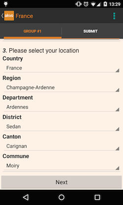

Data
====

The Data tab is where you can view, edit, import and clean data from FLOW surveys. In addition, you can define cascade resources, which can be used in surveys.

Inspect Data tab
----------------

The Inspect Data table is a live feed of all the data submitted from devices connected to your FLOW dashboard. Its default view contains all data, with the most recent records at the top. You can page through the data using the Next and Previous buttons at the bottom of the table, or filter based on a collection of parameters.

 .. figure:: https://cloud.githubusercontent.com/assets/12456965/9084615/d116cf92-3b75-11e5-988b-d5a369c1a33b.png
   :width: 600 px
   :alt: image of dashboard
   :align: center 

   The Inspect Data table.

For each data record submitted, the table contains:

* Instance ID - unique number assigned to the data record by the FLOW database when it's submitted from the device
* Form - the survey group, survey and form that was used to collect the data record
* Submitter - the user name set on the device from 'Manage Users', to identify which device user submitted the data record
* Device ID - the device ID set in the device preferences, to help identify the device
* Collected - the date and time the data record was submitted from the device
* Action - options to edit and delete (for Admin level users)

Filtering data
~~~~~~~~~~~~~~

There are a collection of parameters above the data table that allow you to filter what data records you see, as on the collection date, the instance ID, device ID, and on the name of the submitter. You can filter on one or more parameters by making your selection(s) and then clicking the Find button. The records in the table will filter accordingly. To return to the full listing, clear all the filters and press Find again.

Editing data
~~~~~~~~~~~~

To edit a data record, locate it in the data table and click Edit in the Action column. The Edit Answers window will appear.

 .. figure:: img/4-data_editdata_pop.png
   :width: 600 px
   :alt: image of dashboard
   :align: center 

   The Edit answers window, where you can view and edit responses to a survey that has been submitted to the dashboard.

The Edit Answers window contains a list of the questions and their responses for that data record. Fields that are editable have blue text. When you click on blue text you can edit the answer to that question, clicking Save when you are done, or Cancel to discard the changes. Free text and number questions will display a text field, option questions will display a dropdown menu with the available reponse options, and date question will display a date picker. 

 .. figure:: img/4-data_editdata_inprogress.png
   :width: 600 px
   :alt: image of dashboard
   :align: center 
   
   The Edit answers window, with the editing fields open for a free text question and an option question. For option questions, the edit answers window pre-fills the response options.

For photo questions, clicking "Open photo" will open the photo in a new browser window, where you can view or save the photo.

Note: Once you change or delete an answer, this permanently changes the answer in the database and you cannot go back or undo the changes.

Deleting data
~~~~~~~~~~~~~

You can delete individual data records by locating a record in the data table and clicking Delete in the Action column, or by clicking the Delete button at the top of the Edit answers window for that data record..

Note: Only Admin level users have the Delete option available. This action permanently deletes the data record from the FLOW database and cannot be undone.

.. _bulk_upload_data:

Bulk upload data tab
--------------------

The bulk uploader gives you a way to upload data and photo files taken off the device in bulk when data has been collected offline due to limited connectivity in the field. The bulk uploader is situated on the 'Bulk Upload Data' subtab in the data tab.

 .. figure:: img/4-data_bulkupload.png
   :width: 600 px
   :alt: image of dashboard
   :align: center 

   The bulk upload section of the Data tab.

The first step is to get the data from the device. To do this, follow these steps:

1. Connect the device to a computer using a USB cable, so you can see the contents of the sd-card. For some computers you must enable MTP mode, Media Transfer Protocol, on your device. If differently, your zip file will not be transferred and you will only save pictures on your computer.

2. Go to the folder where the data is stored. When using FLOW app with version below 2.0, this is the 'surveyal' folder, inside the 'fieldsurvey' folder. For FLOW apps with version larger than 2.0, this is the 'data' folder inside the 'akvoflow' folder.

3. Create a single zip file of the entire folder (so the 'surveyal' or the 'data' folder).

4. Move the zip file to the computer.

Secondly, you need to upload the data using the dashboard. There are two ways to do this. First, you can drag and drop them into the box on the dashboard, which will start the upload right away. Second, you can click "select from computer" and select the files to upload.

Note: Navigating away from the page while the upload is in progress, either by navigating elsewhere on the dashboard or closing the browser window will interrupt and cancel the upload in progress.

After you drop or select the files, you will see a progress bar below informing you of the upload contents and status. When the upload is complete, you'll see a confirmation message. After the initial upload, it will take some time before the data are available on the rest of the dashboard for viewing and reporting. Check the Messages tab to confirm when the data are available.

Data cleaning tab
-----------------

After data have come in from the field they sometimes require cleaning to correct things like errors or mis-spellings. In data cleaning, you can export a raw data report into Excel, clean the data as necessary, and then re-import the spreadsheet. This action will permanently overwrite the existing data in the database with the cleaned data you import.

 .. figure:: img/4-data_datacleaning.png
   :width: 600 px
   :alt: image of dashboard
   :align: center 

   The data cleaning section of the Data tab.

The spreadsheet you import must by in .xls or .xlsx format.

To export the raw data report, first select a survey group and survey from the dropdown menus. Click Raw Data Report under Export raw data report and the report will download through your browser. Perform a "Save As" on the report to preserve the original download, and clean the data in the new version.

When you are ready to re-import the cleaned data spreadsheet, return to the page and select the survey group and survey from the dropdown menus. Click Choose File under Import cleaned survey data, and select the spreadsheet from the location where you saved it on your computer. You'll see the file name appear next to Choose File after you've selected it. Click Import Clean Data and the spreadsheet will begin to import.

A progress bar will appear below informing you of the content and status of the import. When the import is complete, you'll see a confirmation message. After the initial import, it will take some time before the data are available on the rest of the dashboard for viewing and reporting. Check the Messages tab to confirm when the data are available.

Monitoring tab - view data points
-----------------------------------

To see which data points are available for a monitoring project, open the 'Monitoring' subtab on the 'Data' tab. There, you can select the survey group that contains the monitoring project, and you will see a table with the data points within that project. The table shows 'identifier', 'display name', and 'last update'. The identifier is the unique identifier of the data point. The display name is derived from answers to questions in the 'registration' form. The setting 'display in data point list on device' on free text questions determines if answers to that question become part of the display name. (see :doc:`../../tutorials/monitoring` for the whole story on how to use monitoring.)

 .. figure:: img/3-monitoring.png
   :width: 800 px
   :alt: Illustration of monitoring
   :align: center

When you click 'view details' on any one of the data points in the table, you will see the survey responses that are part of a single data point. For each submitted survey response, the survey, submitter, device, and collection data are displayed.

When you click 'view details' on a survey response, you will see the individual answers given to the questions in that response.

Cascading resources tab
-----------------------
In a survey, sometimes a choice for question 1 should determine what options are shown in question 2, and so on. Determining a location is a good example: in a first dropdown question you choose the region, and then in the next dropdown, you can choose from the districts in that region, etc. We call these 'cascading questions', as the effect of a choice on the first question cascades into the next questions. Another example might be one question for the brand of a car, and then the second question the type, and a third the production year. A single cascading question in a form is then enough to generate the necessary dropdowns in the form shown on the device.

Restricting the choices in dropdowns to only those that make sense saves time for enumerators and reduces errors. In the Cascading Resources tab, you can create the resources that are needed for these questions. You can create them either through an easy-to-use web interface, or by direct upload of a csv file with the data. 

   A cascade question capturing six levels of administrative areas in France

Creating a new cascade resource
~~~~~~~~~~~~~~~~~~~~~~~~~~~~~~~
On the cascade tab, you can either select an existing cascade resource from the dropdown box, or create a new one. 

 .. figure:: img/4-data-new_cascade.png
   :width: 750 px
   :alt: Illustration of monitoring
   :align: center

   1: select an existing cascade resource, 2: create a new one.

When you click the 'Add new cascade' button, you can provide a name, and click 'Save'. The new resource is opened for edit immediately, and looks like this:

 .. figure:: img/4-cascade_new.png
   :width: 750 px
   :alt: Illustration of monitoring
   :align: center

   A new cascade resource. The coloured numbers are just for illustration.

A lot is going on here, so we have numbered the individual buttons and fields. This is what they do:

1. The name of the cascade resource. When you create the cascade question later, you can select the resource from a list. The name is not used in the device.
2. 'Publish' publishes the cascade resource. What this does is package all the resource data into a single file that can later be downloaded by devices. This only needs to happen when all the editing is done.
3. 'Delete' deletes a resource. Don't do this if you use the resource in surveys.
4. 'Import cascade data' can be used to import a csv file containg data that defines a cascade resource (more on this below).
5. The number of levels in the hierarchy of the resource. An empty resource starts with a single level
6. Publishing status of the resource.
7. A breadcrumb, indicating which levels are currently visible, and what their names are. Clicking on one of the levels makes it visible in the columns.
8. 'Add a level' adds a level in the hierarchy, which can then be edited.
9. The 'pencil' icon can be used to edit the name of the level
10. Individual items can be added here. An item must have a name, and can have a code. Clicking 'Add' adds the item to the list. Items that are added are saved automatically.
11. Only three columns are shown at a time. However, if the resource has more levels, you can navigate to higher and lower levels using these buttons

Using the web interface to add nodes
~~~~~~~~~~~~~~~~~~~~~~~~~~~~~~~~~~~~
In the image below, we have added a number of items on 4 levels of the cascade resource. We used 'Add level' to add the various levels. We used the 'pencil' icon to edit the names of the levels. To see the fourth level, we could either click on the fourth item in the breadcrumb, or use the 'Move Right' button at the bottom.

 .. figure:: img/4-data_cascade_france_1.png
   :width: 750 px
   :alt: Illustration of monitoring
   :align: center

   A cascade resource with items filled in manually.

To start using this cascade resource, we need to click 'Publish' when we are done editing.

Uploading cascade data directly
~~~~~~~~~~~~~~~~~~~~~~~~~~~~~~~
Obviously, it is a lot of work to manually add all these items. It is often the case that this data is available in the form of an excel file. This data can be uploaded to the FLOW system, which will automatically create the required nodes. The format of the file usually looks something like this:

 .. figure:: img/4-data_cascad_Excel.png
   :width: 750 px
   :alt: Illustration of monitoring
   :align: center

   Format for uploading cascade resource data

The first column has the lowest level administrative area names, the next column has the next level up, etc. Importantly, the lowest level names are repeated for each row. IMPORTANT - the file should NOT have a first column with the names of the levels. These need to be provided later in the user interface.

In some cases, codes are available for the various levels as well. If these are available, the format of the file should be like this:

 .. figure:: img/4-data_cascade_excel2.png
   :width: 750 px
   :alt: Illustration of monitoring
   :align: center

   Format for uploading cascade resource data with codes

In order to upload the data, it needs to be in the correct format, and it needs to be saved in csv format. It is very important to check if the file has the right encoding (UTF-8), because otherwise accented letters can get mangled.

**Uploading cascade data**
If you have a csv file available with cascade data, you can upload it by following these steps:

1. Create a cascade resource in which you want to upload the data. In this case, we created one for Benin
2. Click the 'Import cascade data' button. This will show an area with a number of options.

 .. figure:: img/4-data_cascade_upload.png
   :width: 500 px
   :alt: Illustration of monitoring
   :align: center

3. Provide the following information and take these actions:
   1) Enter the number of levels in the data
   2) Select the box if the data contains code columns
   3) Select the csv file on your computer
   4) click 'Import Cascade file'

 .. figure:: img/4-data_upload_complete.png
   :width: 500 px
   :alt: Illustration of monitoring
   :align: center

   Dialog box shown after upload.

4. A dialog box will be shown after upload. The processing might take a while, especially if there are a lot of items in the file. You can go to the Messages tab to see the progress. If everything worked out, you should see a message that the csv file has been imported correctly.

 .. figure:: img/4-data-cascadeSucces.png
   :width: 300 px
   :alt: Illustration of monitoring
   :align: center

   Message shown in the message tab after a succesfull upload.

5. If after a successful upload you go back to the cascade and select it again, you will see the newly uploaded items.

 .. figure:: img/4-data_cascade_benin2.png
   :width: 1000 px
   :alt: Illustration of monitoring
   :align: center

6. Provide proper names to the levels by clicking the 'pencil' icon next to the level names.

Publishing a cascade resource
~~~~~~~~~~~~~~~~~~~~~~~~~~~~~
When everything is ready, click the 'Publish' button. After publishing, the cascade resoure is ready to be used in question definitions. You can check if a resource has been published correctly by visiting the Message tab. Publishing can take a while, especially if there are a large number of items. If the publishing succeeded, you will see a message such as this:

 .. figure:: img/4-data_cascade_benin_2.png
   :width: 400 px
   :alt: Illustration of monitoring
   :align: center

Using a cascade resource in a question
~~~~~~~~~~~~~~~~~~~~~~~~~~~~~~~~~~~~~~~
To use the cascade resource in a question, follow these steps:

1. Open the form in which you want to place the cascade question
2. Create a new question of the type 'cascade'
3. Select the cascade resource that you want to use
4. Save the question.

 .. figure:: img/4-data_cascade_question.png
   :width: 750 px
   :alt: Illustration of monitoring
   :align: center

   Selecting the cascade resource in a question.

If you can't find the cascade resource in the list, it probably has not been published yet. Only published cascade resources are shown in the list.

