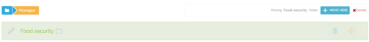
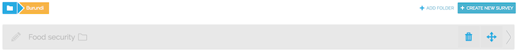
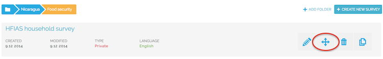
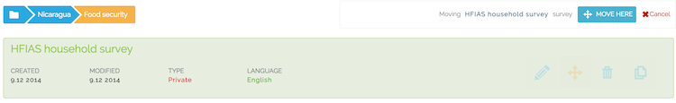

Working with survey folders
----------------------------
The Survey page shows a list of all survey folders. Folders can contain other folders, just as in a regular file system on a computer. Folders can also contain a mix of surveys and folders. 

 .. figure:: ../img/2-surveys_subfolder.png
   :width: 750 px
   :alt: image of dashboard
   :align: center 

   Example, showing a subfolder 'Nicaragua' containing 4 subfolders.

**Navigating between folders**

You can enter a folder by clicking on the name. At the top, breadcrumb navigation shows where you are in the folder hierarchy. Clicking on items in the breadcrumb will take you to that folder.

 .. figure:: ../img/2-breadcrumb.png
   :width: 200 px
   :alt: image of breadcrumb
   :align: center 

   Breadcrumb navigation

**Creating new folders**

When you are in a specific folder, you can create a new subfolder by clicking the 'Add Folder' button. This will create a new folder called 'New folder'. By clicking on the pencil icon, you can edit the name of the folder. Clicking the pencil icon again will save the change.

 .. figure:: ../img/2-add_folder.png
   :width: 180 px
   :alt: image of add folder
   :align: center 

   Adding a folder

**Editing the folder name**

By clicking on the pencil icon to the left of the folder name, you can edit the name of the folder. Clicking the pencil icon again will save the change.

 .. figure:: ../img/2-edit_name.png
   :width: 750 px
   :alt: image of add folder
   :align: center 

   Editing the folder name

**Moving folders**

You can move a folder by clicking on the 'move' icon. The selected folder turns green, after which you can navigate to a different folder and select 'Move here'. This will move the folder to the new location.

 .. figure:: ../img/2-move_folder_1.png
   :width: 750 px
   :alt: image of add folder
   :align: center 

   Selecting the 'Food security' folder for moving

   The folder has been selected and can now be moved

   In a different folder, you can select 'Move here'

   The 'Food security' folder has now been moved

**Deleting folders**

A folder can be deleted by clicking on the 'delete' icon. A folder can only be deleted if it doesn't contain any surveys. In fact, if a folder contains surveys, the delete icon is not shown.

   Delete a folder by clicking the 'delete' icon

**Moving surveys**

You can move a survey from one folder to another by clicking on the 'move' icon. The selected survey turns green, after which you can navigate to a different folder and select 'Move here'. This will move the survey to the new location.

   Select a survey for moving

   The survey is selected and can be moved

   In a different folder, you can select 'Move here'

.. figure:: ../img/2-move_survey_4.png
   :width: 750 px
   :alt: image of add folder
   :align: center 

   The survey has been moved to the new location.

