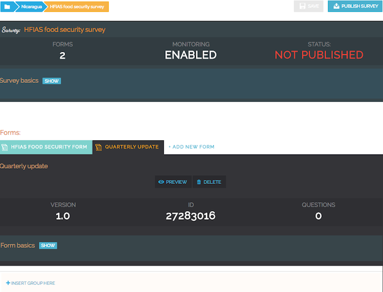

Monitoring - tracking things over time
--------------------------------------

Taking a survey of something, be it a water point, a tree, or a school, is usually a one-time event. You collect data, analyse the data, take action, and that's it. But in many cases, you also want to go back at a later date, and do a follow-up: is this pump still working? Has the tree grown? Has that schools' latrine been repaired? This is what we call monitoring: observing facts about something, some 'entity' (machine, pump, person, etc), which has an identity and can be tracked over time. An identity is a set of attributes (id, serial number, name, etc) that *uniquely* identify an entity. 

The core idea of monitoring is to create 'data points', to which information about a data point can be added. Multiple forms can be added to a single survey, which together capture different aspects of a data point. One form is used to create a new data point, and the other forms are used to add additional information to an existing data point. Also see :doc:`../../tutorials/monitoring` for the whole story on how to use monitoring.

Creating a monitoring survey
++++++++++++++++++++++++++++++
A monitoring survey consists of a single survey which has multiple forms inside. To create a monitoring survey, follow these steps:

1. To add multiple forms to a survey, you first need to enable monitoring on the survey. First go to the survey basics, and select 'Show advanced settings'.

 .. figure:: ../img/2-show_advanced.png
   :width: 200 px
   :alt: image of dashboard
   :align: center 

 .. figure:: ../img/2-survey_enable_monitor.png
   :width: 200 px
   :alt: image of dashboard
   :align: center 

   Enabling monitoring on a survey.

Next, you can check the checkbox 'Enable monitoring features'. When this has been enabled, you can create multiple forms, as shown below. In addition, you need to select the form which will be used to create new data points. By default, this is the first form that was created. Other forms will just be able to update existing data points.

 .. figure:: ../img/2-extra_form.png
   :width: 750 px
   :alt: image of dashboard
   :align: center 

3. Create the forms you need. In the form that will be used to create new data points, there are two checkboxes which are important. 
   
   a. The first one is *Use in data point display*, which is shown on free text questions. When this is checked, the answer to this question will become part of the 'name' of the data point. This will be shown in lists on the device, and can be used to search data points. By default, this is off. This should only be enabled for one or two questions which will help to identify the data point, such as an id, or a name. Multiple values will be added together separated by a dash '-'.
   
   b. The second one is *Use as data point location*, which is shown on geolocation questions. When this is checked, the location captured by this question will be used as the main location of the data point. By default, this is turned on.

4. Be sure that the right form has been selected as registration form, in step 1.

   A monitoring survey with two forms.

5. Publish the survey. After publising, you can assign the forms to devices as usual, or download them manually using their ID.

.. container:: clearer

    .. image:: /img/spacer.png

Structuring your survey forms
++++++++++++++++++++++++++++++
Because you can use different forms to collect data on a data point, the question comes up what questions to ask in which forms. The guideline to follow is this:

* Information captured once - Information that identifies the entity you are monitoring should go in the survey that creates the data point. For example, if you monitor a water meter, you would create a 'water meter registration' form, which captures the name of the owner, his/her address, and the meter id. Not more.

* Information tracked over time — Information about the entity that will probably change, and that you want to track over time, should go in a different form. For example, you might have a 'water meter reading' form, which just captures the current water meter reading and a photo of the current water meter reading.  