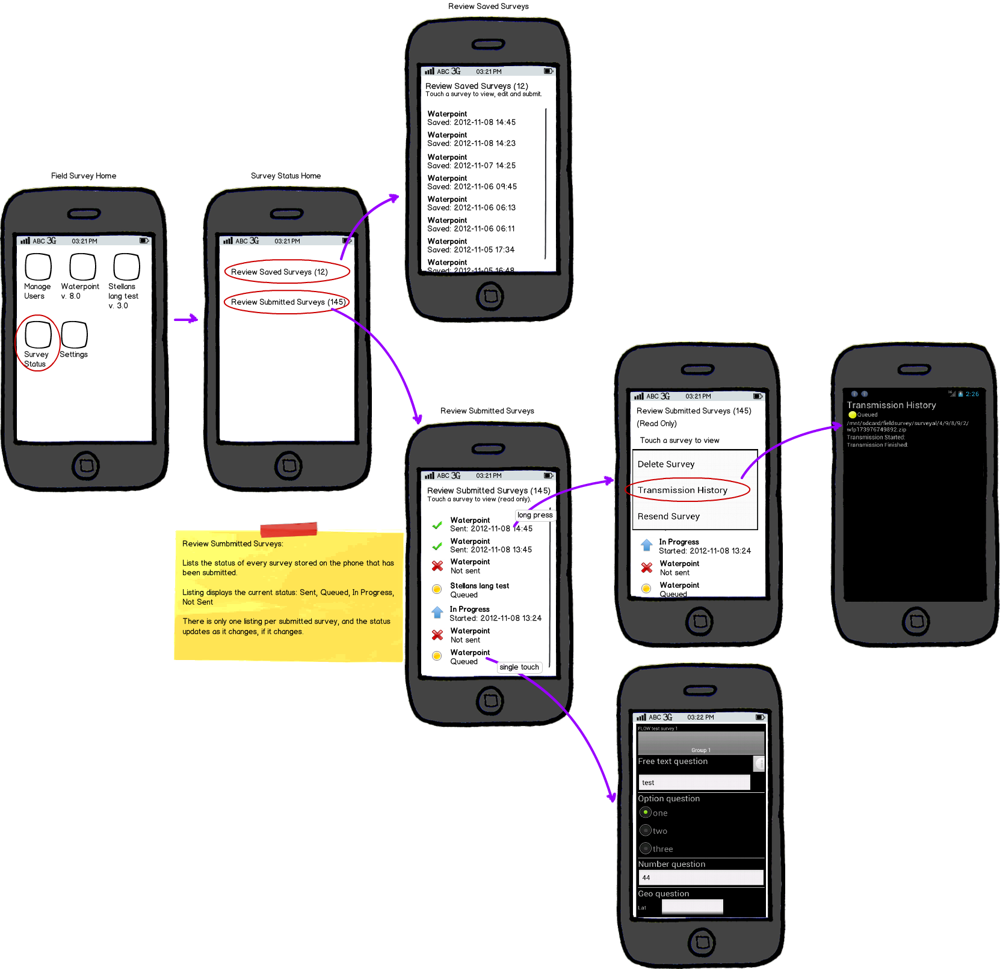

Survey Transmission
===================

type: feature update

Revise view of Submitted Surveys and Transmission History on device to make it clearer for users to see when surveys have been sent successfully.

User Story
----------

As a device user, I need to be able to check the transmission history of multiple surveys from the device to confirm whether they have been sent.

Requirements
------------
	* Can check status on the device
	* Can see on one screen the current transmission status of all submitted surveys, clearly coded by colored symbols 
	* Can long press through from the submitted summary list to see detailed history of a single survey
	* Summary screen is two clicks or less from the field survey home screen

Details
-------
	* Icons are green check for sent, red x for not sent, yellow circle for queued, blue arrow for in progress
	* Summary screen has surveys listed in reverse chronological order, with survey name listed with date and time stamp
	* Home screen icon changed to Survey Status
	
Mockup(s)
---------

apk_reviewsurveystatus.bmml

apk_reviewsurveystatus_v0.png

   Mockup of review survey status feature update 2012-11-09
