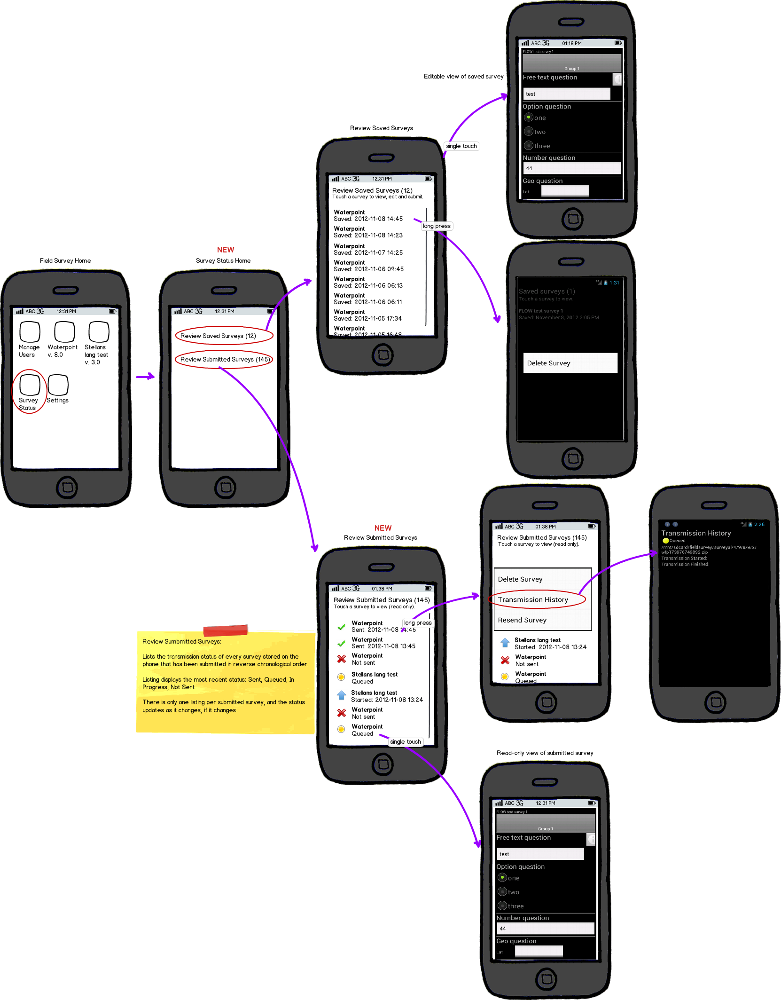

Viewing Survey Transmission Status [update]
===========================================

**type**: feature update

**last revision**: 2012-Nov-15 cmo

**summary**: Revise view of Submitted Surveys and Transmission History on device to make it clearer for users to see the transmission status of individual surveys.

User Story
----------

As a device user, I need to be able to check the transmission history of multiple surveys from the device to confirm whether they have been sent.

Requirements
------------
	* Device user can check survey transmission status on the device
	* Bring Submitted Surveys out from behind menu button to display alongside Saved Surveys
	* Show number of Saved and Submitted surveys next on Survey Status first screen
	* Device user can see on one screen the most recent transmission status of all submitted surveys, clearly coded by colored symbols 
	* Can long press through from the submitted summary list to see detailed history of a single survey
	* Summary screen is two clicks or less from the field survey home screen
	* Use status icons already in apk resources

Details
-------
	* All listings are in reverse chronological order (most recent first)
	* Icons are green check for sent, red x for not sent, yellow circle for queued, blue arrow for in progress
	* Summary screen has surveys listed in reverse chronological order, with survey name listed with date and time stamp
	* Summary screen shows only one entry per survey
	* Summary screen queries every 10 seconds for status changes
	* Home screen icon text changed from "Review Saved Surveys" to "Review Survey Status"; icon stays the same
	
Mockup(s)
---------

apk_reviewsurveystatus.bmml

apk_reviewsurveystatus_v1.png

   Mockup of review survey status feature update 
