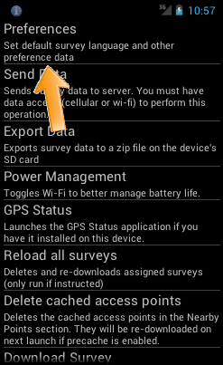
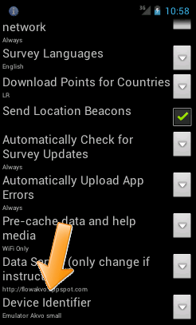
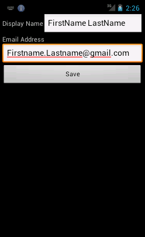
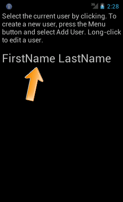
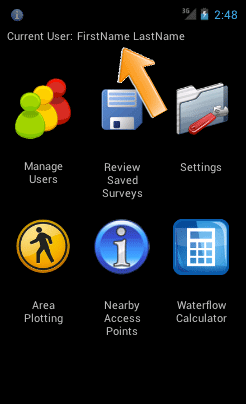
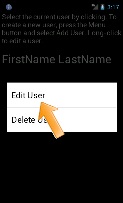
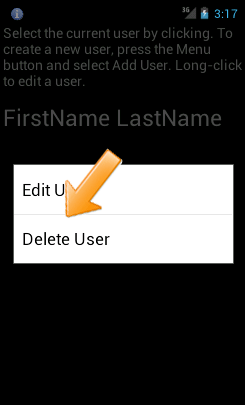
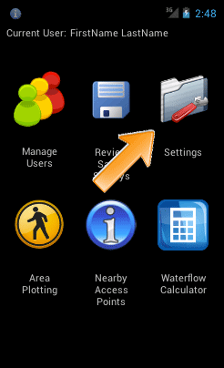
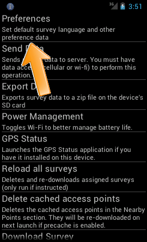
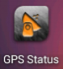

Launching the Field Survey app
==============================
Before you start using the Field Survey App, you must do the following on your phone:

•	`Connect the phone to a Wi-Fi network or mobile data connection. <http://flow.readthedocs.org/en/latest/docs/topic/fieldapp/2-preparing-device.html#set-up-wi-fi.html>`_  
•	`Set the Access Point Name (APN) <http://flow.readthedocs.org/en/latest/docs/topic/fieldapp/2-preparing-device.html#set-access-point-name-apn.html>`_  

**To start the application:**

On the home screen, click on the **Field Survey** icon. 

.. figure:: img/3-0launch_field_survey_app.png
   :width: 200 px
   :alt: image of phone
   :align: center

Set up device ID
----------------
Provide a name (Device ID) for the phone. This name will be used to identify the phone on the FLOW Dashboard. 

**To set up device ID:**

1.	Click on the **Settings** icon on the main screen. 

.. figure:: img/5-launching-app-3-arrow.gif
   :width: 200 px
   :alt: image of phone
   :align: center

2. Select **Preferences**.

2.	Click the **device identifier** option. 

3. You will be asked for authentication, which is "12345". 

.. figure:: img/5-launching-app-6.png
   :width: 200 px
   :alt: image of phone
   :align: center

4.	Provide a name that will help you find back the phone in the Dashboard. Click "Ok". Click **ok**.

.. figure:: img/5-launching-app-7.png
   :width: 200 px
   :alt: image of phone
   :align: center

Updating the Field Survey Application 
-------------------------------------

Whenever a software update becomes available, it is recommended that you download and install the update on your phone.  
To install the update:
1. Get the latest version of the APK file through email as described above, and click Install. 
2. You are prompted to specify whether you want to replace the existing Field Survey application. Choose OK.
3. Click Install. The new version of the application is installed. 
4. A confirmation message appears. Click Done.

Set up users
------------

Creating user
~~~~~~~~~~~~~~~~~~~~~~~~~~

Before you start using FLOW, you first need to create one or more users. During data collection, a specific user needs to be selected so that you can later track the collected data to the field worker who conducted the survey. 

The **Manage Users** feature allows you to create and edit users, and select a particular user for a session. 

**To create a user:**

1. Select **Manage Users** on the main menu. The current list of users will be displayed. At first, this will be empty.

.. figure:: img/7-manage-users-0-arrow.gif
   :width: 200 px
   :alt: image of phone
   :align: center   
	
2. While in the Manage Users screen, press the **Menu** button of the phone. This will display the **Add User** button.

.. figure:: img/7-manage-users-1-arrow.gif
   :width: 200 px
   :alt: image of phone
   :align: center	

3. Select **Add User**.

4. Fill in the name of the user and an email address, and select **Save**.

5. The new user now shows up in the list of users. 

Selecting user
~~~~~~~~~~~~~~~~~~~~~~~~~~

After you have created one or more users, you can select the user by **tapping the name**. 

   
The selected user is displayed at the top of the main menu screen. 

Editing user
~~~~~~~~~~~~~~~~~~~~~~~~~~

To edit a user long-click the username you want to edit. Select **edit user**.

Now you can edit the name and email address. When you’re done, click **save**. 

.. figure:: img/7-manage-users-6.png
   :width: 200 px
   :alt: image of phone
   :align: center

Deleting user
~~~~~~~~~~~~~~~~~~~~~~~~~~

To delete a user long-click the username you want to delete. Select **delete user**. 

You have deleted the user and the name doesn’t appear anymore in the **Manage Users** feature.  

Remember user
~~~~~~~~~~~~~~~~~~~~~~~~~~

If you want the system to remember the selected user the next time you open the app, select the user you want to be remembered. Then click the **Settings** icon on the main screen. 

From there, select **Preferences**. 

   
Then tap the checkbox beside the **Keep the last selected user logged in between session** option.

.. figure:: img/7-manage-users-9-arrow.gif
   :width: 200 px
   :alt: image of phone
   :align: center

Updating Field Survey app
-------------------------
Whenever a software update becomes available, it is recommended that you download and install the update on your phone. The dashboard administrator or Akvo staff can tell you which APK version you should use. 

**To check which version you are currently using:**

1.	Open the **Field Survey App**.
2.	Press **settings**.
3.	Scroll down to About. Click **About**.
4.	Here you can see which **version** is currently installed.

If you are using an old APK version, you need too **install the update**:

1.	Get the latest version of the APK file through email as described here, and click **Install**. 
2.	You are prompted to specify whether you want to replace the existing Field Survey App. Choose **OK**.
3.	Click **Install**. The new version of the application is installed. 
4.	A confirmation message appears. Click **Done**.

Check SD card status
--------------------
Before you start data collection, you need to check if there is enough space available on your SD card. 

We recommend that at least 2 GB is available. However, 4 GB will be better if you need to collect photos as well. 

**To check how much space is left on your SD card:**

1.	In the home screen click **preferences**.
2.	Click **SD card and storage**.
3.	Here you can see how much is the **total space** and **available space**.

Calibrate GPS
-------------
Every time the phones are moved more than 600 miles (500 kilometers) from the last location where they were calibrated, the GPS system needs to be re-calibrated to ensure GPS coordinates are accurate. The calibration can be done with or without a SIM card in the phone.

If the SIM cards and APN are set correctly on the phone, the calibration process takes only a few minutes. If these are not set correctly, it can take up to 30 minutes.
 
You need to install the free App ‘GPS Status & Toolbox’ from the Playstore. 

**To calibrate GPS:**

1.	Take the phone outside to a location where there is a clear view of the sky. It makes no difference whether the sky is cloudy or clear.
2.	On the phone home screen, click the GPS Status icon 

3.	If your GPS is disabled, you are prompted to enable GPS. Select **Use GPS Satellites** and then return to the previous screen. The GPS application appears.

.. figure:: img/3-3GPS_screen.png
   :width: 200 px
   :alt: image of phone
   :align: center
   
4.	Wait until the margin of error appears and is between 5 and 10 meters. This can take anywhere from 30 seconds to 30 minutes. 
