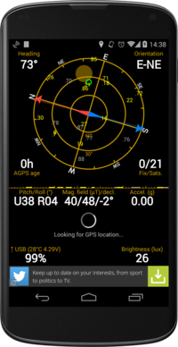
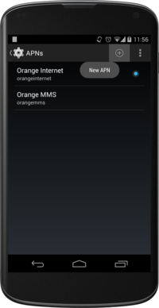

Before installing FLOW
================

To run Akvo FLOW app, your phone must meet the following hardware and software specifications:

Minimum requirements
--------------------

It is essential that the phone you plan on using to collect the data runs **Android 2.3 or newer**, has **GPS** (preferably with GLONASS support), adequate internal storage (at least 4Gb, either internal or through SD card) a **camera**, and adequate screen size (at least 3.7 inch). Important things to consider when selecting a particular phone are battery life, camera resolution, durability, screen size and SD card size. Akvo can assist you in recommending a particular type.

In order to get full advantage of the map features included in the app, the device must have *Google Play Services* installed. Most devices already include this app out of the box, and (usually) users do not have to manually install this software. To check out if your device does include this service, go to your device's *Settings* section, and select *Apps* option. Google Play Services should be listed here.

Some devices do not have SD card support, and have an storage built-in. Many of these devices will still be capable of running Akvo FLOW app, but it is recommended to cross check with Akvo.

When in doubt, please consult with Akvo before buying devices to run FLOW, especially if you are buying large numbers of devices. If you do not follow these guidelines and/or do not consult with us, there is not much we can do to help afterwards.

Recommended requirements
------------------------

======================================  ===========================================================================================================================
	Screen size				   3.7 inch or larger *Note: Although 2.8 inch screens are supported, you may experience issues while typing in data.*

	Battery life				8-10 hours minimum. External backup power recommended, for example by using additional batteries or solar charger.

	Camera resolution			3.2 megapixels or higher

	SD card size				4GB or 8GB. Can be external (meaning you can extract it) or internal storage.

	Operating System			Android 2.3 or higher
======================================  ===========================================================================================================================

Akvo FLOW supports tablets. Although the app layout is not yet optimised for large screens, it will work fine.

Devices can be used with or without SIM card. If you use a SIM card, data can be send over the phone network, or using Wi-FI. If you don't use a SIM card, data transfer over wifi is the only option.

Before you install the Akvo FLOW app on your phone, ensure that your phone is in proper working condition. Place the SD card, optional SIM card, and the battery in the phone and make sure you can send and receive calls and data. Once this is done, ensure that your phone is configured to do the following:

.. _setup_wifi:

Set up Wi-Fi
------------
In order for the phone to update surveys, receive new surveys or transmit submitted surveys, the phone must have a cellular plan with data or must be connected to Wi-Fi. A Wi-Fi Internet connection is the easiest way to connect to the FLOW server for data exchange.

**To connect the phone to a Wi-Fi network:**

1.	On the home screen of the phone, press **Settings**. 

2.	Under **Wireless and Network**, the default setting for Wi-Fi is **OFF**. Enable it.

3.	Select **Wi-Fi**. A list of available Wi-Fi networks displays. 

4.	Choose the network you have access to and provide the password, if prompted. 

5.	Select **Connect**. When connected to Wi-Fi, you can see this Wi-Fi icon at the top of the screen:

.. figure:: img/wifi_icon.png
   :width: 30 px
   :alt: image of phone
   :align: center

*Note: In situations where an Internet or data connection is unavailable you need to setup data collection via Mobile networks (H, 3G, E, G). To do this you need to enable ‘Use packet data’ or ‘Data roaming’.*

Setting date and time on the phone
----------------------------------
Before you start collecting data, it is important to check if the date and time are set correct. The date and time stamp on each data submission takes this information from the phone. If it is set incorrectly, surveys will be submitted with the wrong date and time. 

**To set date and time:**

1.	On the home screen, press **Settings**. 
2.	Click **date and time**.
3.	Check if the date and time are correct, otherwise change. 

Calibrate GPS
-------------
Every time the phones are moved more than 500 km, the GPS system needs to be re-calibrated to ensure GPS coordinates are accurate. 

The calibration can be done with or without a SIM card in the phone. If the phone has a working data connection, either through Wi-Fi or using a SIM card, the calibration process takes only a few minutes. If these are not set correctly, it can take up to 30 minutes.  
 
An easy way to check if the GPS is callibrating correctly is to use the free app ‘GPS Status & Toolbox’, which can be installed from the Playstore. An alternative way of installing the app is described here: :ref:`installing_gps_tools`

**To calibrate GPS:**

1.	Take the phone outside to a location where there is a clear view of the sky. It makes no difference whether the sky is cloudy or clear.
2.	Open the GPS Status app
3.	If your GPS is disabled, you are prompted to enable GPS. Select **Use GPS Satellites** and then return to the previous screen. The GPS application appears.

   
4.	Wait until the margin of error appears and is between 5 and 10 meters. This can take anywhere from 30 seconds to 30 minutes. 

.. _check_sd_card:

Check SD card status
--------------------
Before you start data collection, you need to check if there is enough space available on your SD card. 

We recommend that at least 2 GB is available. However, 4 GB will be better if you need to collect many photos as well. 

**To check how much space is left on your SD card:**

1.	In the home screen click **Settings**, and then **Preferences**.
2.	Click **SD card and storage**.
3.	Here you can see how much is the **total space** and **available space**.

.. _setup_APN:

Set Access Point Name (APN)
---------------------------
Depending on your situation, this section may not be necessary. If your data plan is already working for your phone, you can skip this.

Local Internet service providers use APN settings to activate data plans using SIM cards on phones that were purchased abroad. Every service provider has different APN settings and they change these settings periodically for security reasons. When you purchase the SIM cards, ask the Internet Service Provider to give you the correct APN settings for the SIM Card.

**To set the Access Point name:**

1. On the home screen, press **Settings**. 

2. From the options, choose **More…** and then select **Mobile Networks**.

3. Select **Access Point Name**.

4. Press the **Menu** button and select **New APN**.

   
5. Fill in the required APN settings for your SIM card. You can get the correct APN settings for the SIM Card from your Internet Service Provider.

   
6. Press the **Home** key when you are done.   
