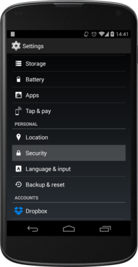
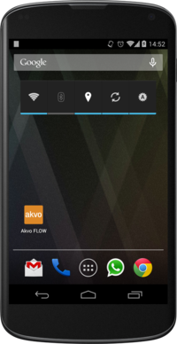

Installation of FLOW app
========================

This document describes two ways of installing the Akvo FLOW app on a phone or tablet: a simple way that can be used if there is Wi-Fi or 3G available, and a more technical way that can be used when no internet connection is available. In most cases, the first option (installation by direct download) will work, and is the preferred method. Before installing, the device needs to be prepared.

Preparing the phone
-------------------

Before the FLOW app can be installed, the device must be configured to allow download and installation of third-party software. Follow these steps to do this:

1. Under Settings, select Security. 

2. Enable the setting *Unknown sources* (If you cannot find the Unknown sources option under Security, check under Applications).

Installation by direct download
-------------------------------

Follow these steps to download the app directly to the device:

1. Open the browser on the device. The browser app might be called *Internet* or *Browser*, or it could otherwise be an specific browser name (i.e. Chrome, Firefox, etc)

2. In the browser address bar, type the address of your Akvo FLOW dashboard, and add '/app2'. For example, if your organisation is called 'care', this would usually be 'care.akvoflow.org/app2'. Please check with your project manager to get the right dashboard location.

3. When you have typed the address, including the '/app2', click 'Go' on the keyboard. This will download the latest version of the FLOW app directly. You will see the download icon in the notification bar at the top of the screen.

.. figure:: img/2-downloadicon.png
   :width: 50 px
   :alt: Download icon
   :align: center

4. When the download is complete, draw down the notification bar from the top of the screen. If the download succeeded, you will see *flow-2.x.x.apk, download complete*. Click on the notification, and click *Install*.

Installation by putting the app on the phone directly
-----------------------------------------------------

When internet is not available, there is an alternative way to install the app:

1. Get the Akvo FLOW app APK file on your pc or laptop. For this, you need to be connected to the internet. You can get the file by opening a web browser, and in the address bar type the address of your Akvo FLOW dashboard, and add '/app2'. For example, if your organisation is called 'care', this would usually be 'care.akvoflow.org/app2'. Please check with your project manager to get the right dashboard location. Save the APK file to your computer.

2. In the location without internet connection, connect the device to a computer using a usb cable, so you can see the contents of the SD card. On the SD card, create a temporary folder, for example called 'temp'.

3. Copy the FLOW app .apk file to this temporary folder.

4. Disconnect the device from the computer.

5. On the device, open the app called 'My Files', and locate the temporary folder that holds the APK on the device.

6. Click the APK to install it.

Note: If *My Files* app is not available in the device, you can use any other app capable of browsing the file system (i.e File Manager).

Updating the Akvo FLOW app
--------------------------

Starting with version 1.13.0, the Akvo FLOW app can be automatically updated from within the app. The original method of sending the APK file to the device by email and installing it from there will remain available, but this new feature will make updating the app much easier.

1. Whenever a new Akvo FLOW app update is available, the app will display a pop-up, asking the user to update the app.

.. figure:: img/upgrade-popup.png
   :width: 200 px
   :alt: App update available pop-up
   :align: center

2. At this point, it is up to the user when to update the app. However, this update will require a reliable network connection, as the whole app file has to be downloaded. This is best done on a WiFi connection, to ensure the file is downloaded correctly. If you are ready to install the update, click **Download & Install**.

3. After the download is complete, click 'Install'.

The new version of the Akvo FLOW app will now be installed and ready to use. Note that all collected data will still remain in the device.

Create a shortcut on the home screen
------------------------------------

For easy access, create a shortcut to the Field Survey app on the home screen. 

To create a shortcut:

1. Click on the Applications icon on the phone home screen. 
2. From the list of applications, press and hold on the Akvo FLOW app icon. 
3. The shortcut to the Akvo FLOW app now appears on your home screen.

   After long-clicking on the Field Survey app, the icon is placed on the home screen

.. _installing_gps_tools:

Installing GPS tools
--------------------

In addition to the Akvo FLOW app, we recommend using an app that allows you to calibrate and monitor the GPS. A free, suitable app is *GPS Status & Toolbox*.

Obtaining and using GPS Status & Toolbox:

1. Use the direct download method described above. In the browser, go to xxxx.akvoflow.org/gps. (replace xxxx with the flow dashboard name) This will download the GPS Status app. In the notification bar, click on the app to install it, as described above.

2. When the app is installed, open it. The app will automatically try to download the AGPS data it needs.
