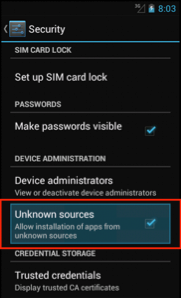
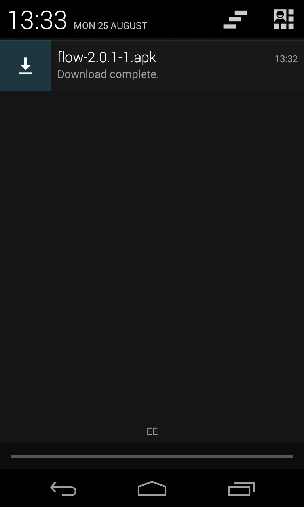
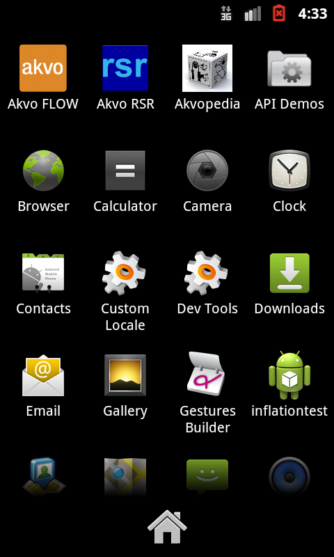
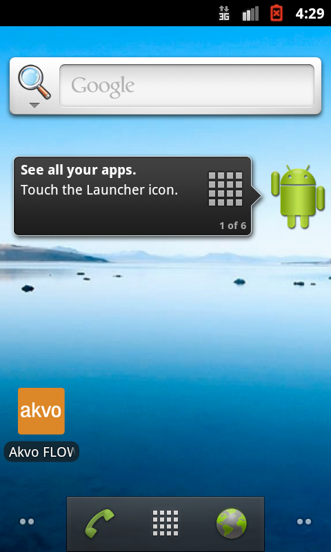

Before you install the Akvo FLOW app
====================================
Before you install the Akvo FLOW app on your phone, ensure that your phone is in proper working condition. Place the SD card, the SIM card, and the battery in the phone and make sure you can send and receive calls and data. Once this is done, ensure that your phone is configured to do the following:

Set up Wi-Fi
------------
In order for the phone to update surveys, receive new surveys or transmit submitted surveys, the phone must have a cellular plan with data or must be connected to Wi-Fi. A Wi-Fi Internet connection is the easiest way to connect to the FLOW server for data exchange.

**To connect the phone to a Wi-Fi network:**

1.	On the home screen of the phone, press **Settings**. 

2.	Under **Wireless and Network**, the default setting for Wi-Fi is **OFF**. Tap on **OFF** to change it to **ON**. 

3.	Select **Wi-Fi**. A list of available Wi-Fi networks displays. 

4.	Choose the network you have access to and provide the password, if prompted. 

5.	Select **Connect**. When connected to Wi-Fi, you can see this Wi-Fi icon at the top of the screen:

.. figure:: img/wifi_icon.png
   :width: 30 px
   :alt: image of phone
   :align: center

*Note: In situations where an Internet or data connection is unavailable you need to setup data collection via Mobile networks (H, 3G, E, G). To do this you need to enable ‘Use packet data’ or ‘Data roaming’.*

Set Access Point Name (APN)
---------------------------
Depending on your situation, this section may not be necessary. If your data plan is already working for your phone, you can skip this.

Local Internet service providers use APN settings to activate data plans using SIM cards on phones that were purchased abroad. Every service provider has different APN settings and they change these settings periodically for security reasons. When you purchase the SIM cards, ask the Internet Service Provider to give you the correct APN settings for the SIM Card.

**To set the Access Point name:**

1.	On the home screen, press **Settings**. 

2.	From the options, choose **More…** and then select **Mobile Networks**.

.. figure:: img/2-1set_APN_select_more_from_settings.png
   :width: 200 px
   :alt: image of phone
   :align: center

3.	Select **Access Point Name**.

.. figure:: img/2-1set_access_point_name.png
   :width: 200 px
   :alt: image of phone
   :align: center

4.	Press the **Menu** button and select **New APN**.

.. figure:: img/2-1select_new_APN.png
   :width: 200 px
   :alt: image of phone
   :align: center
   
5.	Fill in the required APN settings for your SIM card. You can get the correct APN settings for the SIM Card from your Internet Service Provider.

.. figure:: img/2-1fill_in_required_APN_settings.png
   :width: 200 px
   :alt: image of phone
   :align: center
   
6.	Press the **Home** key when you are done.   
   

Setting data and time on the phone
----------------------------------
Before you start collecting data, it is important to check it the date and time are set correct. The date and time stamp on each data submission takes this information from the phone. If it is set incorrectly, you will get errant date/time stamps. 

**To set date and time:**

1.	On the home screen, press **Settings**. 
2.	Click **date and time**.
3.	Check if the date and time are correct, otherwise change. 

Installing the Akvo FLOW app
============================

This document describes two ways of installing the Akvo FLOW app on a phone or tablet: a simple way that can be used if there is Wi-Fi or 3G available, and a more technical way that can be used when no such Internet connection is available. In most cases, the first option (installation by direct download) will work, and is the preferred method. Before installing, the device needs to be prepared.

Preparing the phone
-------------------

Before the FLOW app can be installed, the device must be configured to allow download and installation of third-party software. Follow these steps to do this:

1. Under Settings, select Security. 

.. figure:: img/2-settings-security.png
   :width: 200 px
   :alt: Settings > Security
   :align: center

2. Enable the setting *Unknown sources* (If you cannot find the Unknown sources option under Security, check under Applications).

Installation by direct download
-------------------------------

Follow these steps to download the app directly to the device:

1. Open the browser on the device. The browser app might be called *Internet* or *Browser*, or it could otherwise be an specific browser name (i.e. Chrome, Firefox, etc)

2. In the browser address bar, type the address of your Akvo FLOW dashboard, and add '/app2'. For example, if your organisation is called 'care', this would usually be 'care.akvoflow.org/app2'. Please check with your project manager to get the right dashboard location.

.. figure:: img/2-downloadapp.png
   :width: 200 px
   :alt: Type in the app URL
   :align: center

3. When you have typed the address, including the '/app2', click 'Go' on the keyboard. This will download the latest version of the FLOW app directly. You will see the download icon in the notification bar at the top of the screen.

.. figure:: img/2-downloadicon.png
   :width: 50 px
   :alt: Download icon
   :align: center

4. When the download is complete, draw down the notification bar from the top of the screen. If the download succeeded, you will see *flow-2.x.x.apk, download complete*. Click on the notification, and click *Install*.

Installation by putting the app on the phone directly
-----------------------------------------------------

When Internet is not available, there is an alternative way to install the app:

1. While in a place where Internet is available, get the Akvo FLOW app APK file. You can get it by opening a web browser, and in the address bar, type the address of your Akvo FLOW dashboard, and add '/app2'. For example, if your organisation is called 'care', this would usually be 'care.akvoflow.org/app2'. Please check with your project manager to get the right dashboard location. Save the APK file to your computer.

2. In the location without Internet connection, connect the device to a computer, so you can see the contents of the SD card. On the SD card, create a temporary folder, for example called 'temp'.

3. Copy the FLOW app .apk file to this temporary folder.

4. Disconnect the device from the computer.

5. On the device, open the app called 'My Files', and locate the temporary folder that holds the APK on the device.

6. Click the APK to install it.

Note: If *My Files* app is not available in the device, you can use any other app capable of browsing the file system (i.e File Manager).

Create a shortcut on the home screen
------------------------------------

For easy access, create a shortcut to the Field Survey app on the home screen. 

To create a shortcut:

1. Click on the Applications icon on the phone home screen. 

2. From the list of applications, press and hold on the Akvo FLOW app icon. 

3. The shortcut to the Akvo FLOW app now appears on your home screen.

   After long-clicking on the Field Survey app, the icon is placed on the home screen

Installing GPS tools
--------------------

In addition to the Akvo FLOW app, we recommend using an app that allows you to calibrate and monitor the GPS. A free, suitable app is *GPS Status & Toolbox*.

Obtaining and using GPS Status & Toolbox:

1. Use the direct download method described above. In the browser, go to xxxx.akvoflow.org/gps. (replace xxxx with the flow instance name) This will download the GPS Status app. In the notification bar, click on the app to install it, as described above.

2. When the app is installed, open it. The app will automatically try to download the AGPS data it needs.
