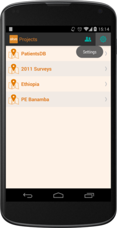
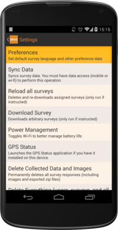
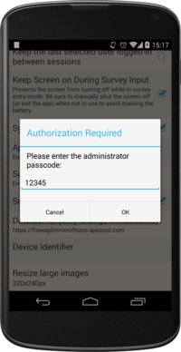
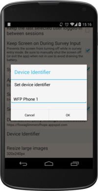
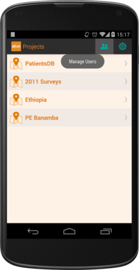
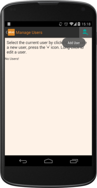
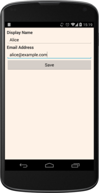
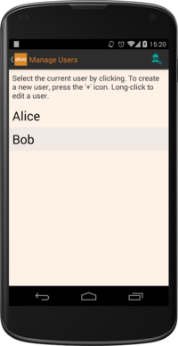
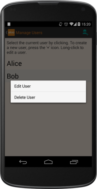
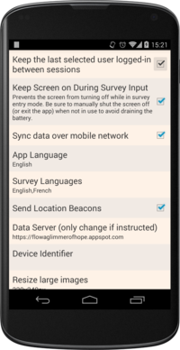

Starting the FLOW app
=====================
Before you start using the Akvo FLOW app, you must do the following on your phone:

•	`Connect the phone to a Wi-Fi network or mobile data connection. :ref:`setup_wifi`_  
•	`Set the Access Point Name (APN). :ref:`setup_APN` (only if needed to activate data plan)

**To start the application:**

In the applications menu, click on the **Akvo FLOW** icon. If you have a shortcut in the home screen, you can also launch the app from there.

.. figure:: img/homescreen-shortcut.png
   :width: 200 px
   :alt: Akvo FLOW app shortcut
   :align: center

Set up device ID
----------------
The first time you activate the FLOW app, you have to privide a name (Device ID) for the phone. This name will be used to identify the phone on the FLOW Dashboard. 

**To set up device ID:**

1.	Click on the **Settings** icon on the main screen.

2. Select **Preferences**.

3.	Click the **Device Identifier** option, and enter the administrator passcode, which is "12345". 

5.	Provide a name that will help you find back the phone in the Dashboard, and click **Ok**.

.. _manage_users:

Manage Users
------------

Creating users
^^^^^^^^^^^^^^

Before you start using FLOW, you first need to create one or more users. During data collection, a specific user needs to be selected so that you can later track the collected data to the field worker who conducted the survey. 

The **Manage Users** feature allows you to create and edit users, and select a particular user for a session. 

**To create a user:**

1. Click on the **Manage Users** icon on the main screen. The current list of users will be displayed. At first, this will be empty.

	
2. While in the Manage Users screen, click the **Add User** icon.

3. Fill in the name of the user and (optionally) an email address, and select **Save**.

5. The new user now shows up in the list of users. To select the current user, **Click the name**.

Editing and Deleting users
^^^^^^^^^^^^^^^^^^^^^^^^^^

If you want to change the name of a user or delete the user long-click on the username you want to change. To edit the user information, click **Edit User**. To delete the user, click **Delete User**.

Remembering user
^^^^^^^^^^^^^^^^

Each time you open the FLOW app, you need to select a user. If you want the device to remember the user that is currently selected, do this:

Click the **Settings** icon on the main screen. 

From there, select **Preferences**. 

   
Then tap the checkbox beside the **Keep the last selected user logged in between session** option.

