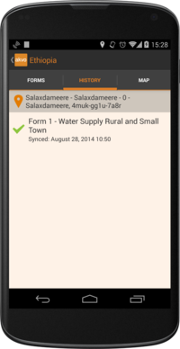

.. _projects_and_datapoints:

Projects and Data Points
========================

Projects
--------
The home screen of the FLOW App displays a list of available data collection projects. In order to collect data in a project, you first must have a user selected. Please, refer to the :ref:`manage_users` section to learn how to create and select users.

.. figure:: img/project-list.png
   :width: 200 px
   :alt: image of phone
   :align: center
   
To select a project, click on its name, and the list of available *Data Points* will be displayed.

.. figure:: img/datapoint-list.png
   :width: 200 px
   :alt: image of phone
   :align: center
    
   Selecting a project displays all the collected data points

When a project is opened for the first time, no data point is available yet. To start, click on the **CREATE NEW DATA POINT** button, and a new data point will be created.

We can sort the data point list by clicking the *Order By* icon, and choose between ordering by date, distance, upload status, or name.

.. figure:: img/orderby.png
   :width: 200 px
   :alt: image of phone
   :align: center

We can also see an overview of the data collection statistics, by clicking the *Project Stats* icon

Data Points
-----------

A data point contains all the information collected for a particular something. Some data points hold more than one form, and all the filled forms are part of the same data point. This is particularly useful when the goal is to track data changes over time, and a given point needs to be monitored periodically.

Each data point has a unique identifier, along with a meaningful name (automatically created based on form responses) and a geolocation. To select a data point, click on it in the *Data Points* tab, or browse the *Map* tab to find it. Clicking on a marker on the map will show you the name and id of the datapoint. Clicking on that name will take you to the datapoint. You can alternatively use the *search* functionality, simply clicking the search icon and typing the data point name or ID.

Monitored data points
^^^^^^^^^^^^^^^^^^^^^
A monitored data point is one that contains multiple forms within it. Typically, one of this forms will be the *Registration form*, which will collect basic data about the entity being surveyed. This normally involves collecting the name, location, etc -- In essence, attributes that **do not** change over time. All forms responded in a Monitored data point will be appended to the history tab. This will let us browse any data collected for a particular point.

Monitored data points can be synchronised, downloading in the device any previously collected data point for a particular project, and adding new responses to them. This means that one device can create a new data point, adding a few responses, and once the data is sent to the server, a different device can download the data point and keep adding data to it.

To synchronise all data points collected in a project, click on the *Sync data points* icon. Note that you will need a reliable internet connection to perform this action.

Synchronisation progress is displayed in an ongoing notification. You can draw dawn the status bar in the device to see the progress.

.. figure:: img/sync-notification.png
   :width: 200 px
   :alt: image of phone
   :align: center

Once the synchronisation is finished, the notification will show the total amount of Data Points synced.

.. figure:: img/sync-finished.png
   :width: 200 px
   :alt: image of phone
   :align: center

Non-monitored Data Points
^^^^^^^^^^^^^^^^^^^^^^^^^
Non-monitored projects contain only a single form. Data points also cannot be synchronised - only locally collected data will be available in the device.

From within a data point, we have access to *Forms*, *History*, and *Map* tabs, which represent form definitions, responses, and point location, respectively.

Forms
^^^^^
*Note: 'Form' and 'Survey' are equivalent terms, and can be used interchangeably.*

**Forms** tab contains the forms for a particular data point. Given the aforementioned description, we may encounter many forms (monitored data point), or a single one (non-monitored data point).

.. figure:: img/form-list.png
   :width: 200 px
   :alt: image of phone
   :align: center

History
^^^^^^^
A big difference between the old and the new app, is how collected data is reviewed in the device.

History contains all the form responses for the given data point. From this tab, we can resume an ongoing form, or review an already submitted one, by clicking the corresponding item in the list.

This tab is particularly useful to check the **form status**, which is displayed next to each form. A form response can have the following statuses:

* **Saved:** This form is not submitted yet, and can be resumed in order to add more answers.
* **Exported:** This form is submitted and exported in the SD card, but the device has not synchronised it with the dashboard. As soon as an Internet connection is available, it will be sent.
* **Synced:** This form is submitted and fully synchronised with the dashboard.

Map
^^^
Map tab allows us to locate the data point in the map. Note that for this to happen, the *registration form* must have been answered, providing its latitude and longitude coordinates.

.. figure:: img/datapoint-map.png
   :width: 200 px
   :alt: image of phone
   :align: center
