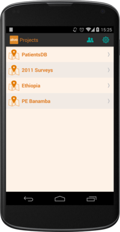
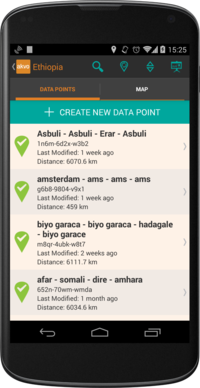
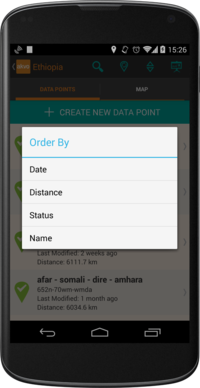
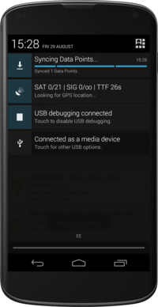
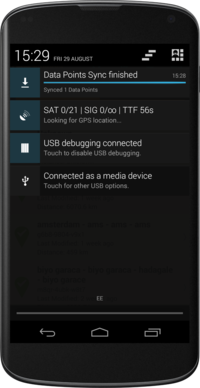
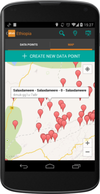

Projects and Data Points
========================

Projects
--------
Unlike previous versions of the Akvo FLOW app, forms are now grouped into projects, which act as containers to group forms with a similar nature. All available projects are presented in the main screen of the app, and are automatically created when synchronising forms into the device (more on form synchronisation later). In order to interact with a project, **you must have a user selected**. Please, refer to the *Manage Users* section to learn how to create and select users.

   
   Every synced project will be available in the home screen of the app

To select a project, click on its name, and the list of available *Data Points* will be displayed.

    
   Selecting a project allows us to browse all its collected Data Points

When a project is opened for the first time, no Data Point is available yet, and we need to create them manually. For this, click on the **CREATE NEW DATA POINT** button, and a new Data Point will be created.

We can sort the Data Point list by clicking the *Order By* icon, and selecting the desired criteria.

We can also see an overview of the data collection statistics, by clicking the *Project Stats* icon

.. figure:: img/stats.png
   :width: 200 px
   :alt: image of phone
   :align: center

*Note:* The current version of Akvo FLOW does not allow project synchronisation or download. Projects are **automatically created** with each form synchronisation.

Data Points
-----------
A Data Point contains all the information collected for a particular *entity*. Some Data Points hold more than one form, and all their responses will be part of the same Data Point. This is particularly useful when the goal is to track data changes over time, and a given point needs to be checked out on a periodical basis. This allows us to effectively relate form responses to the same point, even collecting multiple responses of the same form.

Each Data Point has a unique identifier, along with a meaningful name (automatically created based on form responses) and a geolocation. To select a Data Point, click on its row in the *Data Points* tab, or browse the *Map* tab to find it. You can alternatively use the *search* functionality, simply clicking the search icon and typing the Data Point name or ID.

Monitored Data Points
^^^^^^^^^^^^^^^^^^^^^
A monitored Data Point is one that contains multiple forms within it. Typically, one of this forms will be the *Registration form*, which will collect basic data about the entity being surveyed. This normally involves collecting the name, location, etc -- In essence, attributes that **do not** change over time. All forms responded in a Monitored Data Point will be appended to the history tab. This will let us browse any data collected for a particular point.

Monitored Data Points can be synchronised, downloading in the device any previously collected Data Point for a particular project, and adding new responses to them. This means that one device can create a new Data Point, adding a few responses, and once the data is sent to the server, a different device can download the Data Point and keep adding data to it.

To synchronise all Data Points collected in a project, click on the *Sync Data Points* icon. Note that you will need a reliable internet connection to perform this action.

.. figure:: img/sync-icon.png
   :width: 200 px
   :alt: image of phone
   :align: center

Synchronisation progress is displayed in an ongoing notification. You can draw dawn the status bar in the device to see the progress.

Once the synchronisation is finished, the notification will show the total amount of Data Points synced.

Non-monitored Data Points
^^^^^^^^^^^^^^^^^^^^^^^^^
Non-monitored Data Points behave pretty much like the monitored ones, except with one difference: they only contain one form. Furthermore, Projects holding non-monitored Data Points cannot be synchronised. Only locally collected data will be available in the device.

From within a Data Point, we have access to *Forms*, *History*, and *Map* tabs, which represent form definitions, responses, and point location, respectively.

Forms
^^^^^
*Note: 'Form' and 'Survey' are equivalent terms, and can be used interchangeably.*

**Forms** tab contains the forms for a particular Data Point. Given the aforementioned description, we may encounter many forms (monitored Data Point), or a single one (non-monitored Data Point).

.. figure:: img/form-list.png
   :width: 200 px
   :alt: image of phone
   :align: center

History
^^^^^^^
A big difference between the old and the new app, is how collected data is reviewed in the device.

History contains all the form responses for the given Data Point. From this tab, we can resume an ongoing form, or review an already submitted one, by clicking the corresponding item in the list.

This tab is particularly useful to check the **form status**, which is displayed next to each form. A form response can have the following statuses:

* **Saved:** This form is not submitted yet, and can be resumed in order to add more answers.
* **Exported:** This form is submitted and exported in the SD card, but the device has not synchronised it with the dashboard. As soon as an Internet connection is available, it will be sent.
* **Synced:** This form is submitted and fully synchronised with the dashboard.

.. figure:: img/history.png
   :width: 200 px
   :alt: image of phone
   :align: center

Map
^^^
Map tab allows us to locate the Data Point in the map. Note that for this to happen, the *registration form* must have been answered, providing its latitude and longitude coordinates.

