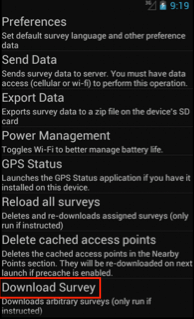
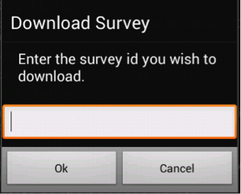

Downloading surveys
===================

There are three ways to get a survey from the FLOW server onto your phone:

Automatic download (create survey assignment)
---------------------------------------------
Every time the Akvo FLOW app is launched, it checks for newly assigned surveys and updates to existing surveys. If there are new or updated surveys available, these are downloaded automatically. When new or updated surveys have been downloaded, the status bar shows a notification. This is the easiest way to get a survey to the phone.

When you launch the application, the phone sends a signal to the web-based FLOW Dashboard to indicate that your device is available for survey assignments. On the Dashboard, the project manager can assign a survey or set of surveys to the device. Assigned surveys are automatically downloaded from the FLOW server when your phone is turned on, provided you have internet or network connectivity.

.. figure:: img/4-1automatic_download_installed_surveys_updated.png
   :width: 200 px
   :alt: image of phone
   :align: center

   TODO: Replace image

Manual download from settings menu
----------------------------------
**To download a specific survey:**

Before you start, you need the ID of the survey. On the dashboard, you can find this if you view the details of the survey. 
1.   On the Akvo FLOW app home screen, click **Settings**. 

.. figure:: img/settings.png
   :width: 200 px
   :alt: Settings
   :align: center

2.   From the list, select **Download Survey**.

   TODO: Replace image

3.   Enter the Authorization passcode **12345** and click **OK**.

.. figure:: img/4-3authorization_passcode.png
   :width: 200 px
   :alt: image of phone
   :align: center

   TODO: Replace image

4.   Enter the Survey ID of the survey you wish to download and click **OK**.

   TODO: Replace image

Manual transfer (bootstrap)
---------------------------
Manual Survey Transfer (formerly known as bootstrap) allows you to generate a file of a FLOW survey you've already published that you can email to yourself or your colleagues to install on devices manually, in situations with low or no connectivity to a wireless or mobile network. How to do this is described in the `Manual survey transfer section <http://flow.readthedocs.org/en/latest/docs/topic/dashboard/3-devices.html#manual-survey-transfer.html>`_ of the Akvo FLOW dashboard documentation.
