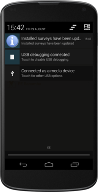

Downloading forms
=================

There are three ways to get a form from the FLOW server onto your phone:

Automatic download (create form assignment)
-------------------------------------------
Every time the Akvo FLOW app is launched, it checks for newly assigned forms and updates to existing forms. If there are new or updated forms available, these are downloaded automatically. When new or updated forms have been downloaded, the status bar shows a notification. This is the easiest way to get a form to the phone.

When you launch the application, the phone sends a signal to the web-based FLOW Dashboard to indicate that your device is available for form assignments. On the Dashboard, the project manager can assign a form or set of forms to the device. Assigned forms are automatically downloaded from the FLOW server when your phone is turned on, provided you have internet or network connectivity.

Manual download from settings menu
----------------------------------
**To download a specific form:**

Before you start, you need the ID of the form. On the dashboard, you can find this if you view the details of the form. 
1.   On the Akvo FLOW app home screen, click **Settings**. 

.. figure:: img/settings-icon.png
   :width: 200 px
   :alt: Settings
   :align: center

2.   From the list, select **Download Survey**.

.. figure:: img/download-survey.png
   :width: 200 px
   :alt: image of phone
   :align: center

3.   Enter the Authorization passcode **12345** and click **OK**.

.. figure:: img/passcode.png
   :width: 200 px
   :alt: image of phone
   :align: center

4.   Enter the Survey ID of the form you wish to download and click **OK**.

Manual transfer (bootstrap)
---------------------------
Manual survey transfer (formerly known as bootstrap) allows you to generate a file of a FLOW form you've already published that you can email to yourself or your colleagues to install on devices manually, in situations with low or no connectivity to a wireless or mobile network. How to do this is described in the `Manual survey transfer section <http://flow.readthedocs.org/en/latest/docs/topic/dashboard/3-devices.html#manual-survey-transfer.html>`_ of the Akvo FLOW dashboard documentation.
