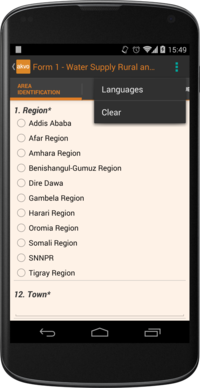

Collecting Data
===============

*Note: If you have used your phone in a previous data collection exercise, it is important to clear all the data off of the phone before you begin the next exercise so that you do not run the risk of exceeding the storage limits of your phone’s SD card and potentially losing data. If you use your phone for ongoing data collection, it is important to clear the phone of data at regular intervals.*

Before filling out a form, we need to select the Data Point for which the data collection is associated to. Refer to the 'Projects and Data Points' section to learn how to create new Data Points.

To provide a new set of answers for a form, just click on its name in the *Forms* tab. Alternatively, you can select a saved form in the *History* tab.

Once the form is opened, you can enter responses to the questions. When you finish entering responses, you submit the form and the data is sent to the FLOW dashboard, where it will be stored and analysed.

From within the form's menu, we have access to a few set of settings:

* **Clear:** Clears all the responses collected so far, without sending them to the server. To clear the response to a particular question, long-click the question text and click OK. 
* **Languages:** Allows you to select one or more languages in which you want the form questions to appear, if the form was configured to support multiple languages. 

Navigating a form 
-----------------
Before you begin collecting data, you must understand that each form contains a series of questions and the questions are organized into smaller sets as question groups. Each group of questions appears in a separate tab on the screen. You can fill in the questions in any order, moving from tab to tab. To switch between tabs, you can either swipe the screen, or click in the tab title.

Question Types
^^^^^^^^^^^^^^

* **Free text** - Plain text question. Text can be letters, numbers and symbols.
* **Option** - Displays a set of preset options to select from. Option questions can be single or multiple answer.
* **Number** - Allows only numbers to be typed into the answer entry field.
* **Geolocation** - Uses the device’s GPS to automatically fill in latitude, longitude and elevation. Click the **Check Geo Location** button to start searching for the position.
* **Photo** and **Video** - Displays the option to take a photo or video as part of the survey. Click the **Take Photo** or **Take Video** buttons on the device to access the device camera.
* **Date** - Displays a date picker to select a date in DD-MM-YYYY format.
* **Barcode** - Displays the option to scan a barcode from the device and record the barcode number in the form. Click the **Scan Barcode** button to trigger the scan reader app. *Note: Requires an external barcode scanning-app to be installed on the device.*

.. figure:: img/questions.png
   :width: 200 px
   :alt: image of phone
   :align: center

Dependent questions
^^^^^^^^^^^^^^^^^^^
Some questions are dependent on the answer from any preceding option question in the same form. The form will be adapted (hiding/showing dependent questions) while conducting the form.

Mandatory questions
^^^^^^^^^^^^^^^^^^^
Questions marked with an asterisk(*) in the title are mandatory. This means that the form cannot be submitted if any of its mandatory questions is not answered yet. The *Submit* tab will display a list with all mandatory questions that are still unanswered.

Help text
^^^^^^^^^
Forms can be configured to include help text. If help is available for a specific question the **help** icon is displayed next to the question text. Click this icon to open the help tool.

.. figure:: img/help.png
   :width: 200 px
   :align: center

   Help icon displays a pop-up with the question help text

Language
^^^^^^^^

If you've created forms with translations on the dashboard and assigned them to your devices, you can access those translations on the device for conducting forms in the field.

To display one or more translations for a form, select *Languages* in the form menu. This will display all of the available translations (i.e. the ones you entered on the dashboard) for all the forms on the device.

.. figure:: img/languages.png
   :width: 200 px
   :alt: image of phone
   :align: center
   
   You can tick as many languages as you want
   
Tick one or more of the language boxes. Ticking one language will display just that language for the form. Ticking more than one will display multiple languages in different colours. Question text, question options, and help text will be displayed in all of the translations you’ve selected if they’ve been entered and published from the dashboard.

After completing all the questions, we are ready to *submit* the form.

Submitting a form
-----------------
When you complete a form, you must submit it for upload to the FLOW server for storage and analysis. Immediate submission is recommended so that data backup is available in case your phone is lost or damaged.

To submit a form, navigate to the **Submit** tab, which is the last tab in the form. If there are unanswered mandatory questions, or invalid answers, the Submit tab lists these questions. The **Submit** button is disabled until all invalid questions are handled.

.. figure:: img/submit.png
   :width: 200 px
   :align: center

   Once all the questions are filled in, you can submit the form

When you click **Submit** at the end of a form, the form is locked to prevent further editing, and uploaded to the FLOW server immediately. If network connectivity is not available, the form is queued in the phone until connectivity is restored. The data will automatically be sent to the server. This connection can be via Wi-Fi or over mobile network. 

As detailed in **Projects and Data Points** section, the form status will be displayed in the *History* tab. A queued form will have a **Exported** status, whereas a fully synced form's status will be **Synced**. Not until all the images attached to a form are sent to the server will the status turn into **Synced**. Users do not have to manually send any form from within the device, for all the transmissions are handled automatically as soon as the internet connection is available.

If you want more in-depth information, you can long-click any submitted form to check its *Transmission Status*. This will display the status of any file transmission within the form.

*Note: It is always better to submit data from the device right away over the network. If users store data on their devices while waiting for an opportunity to import it later, there is always the danger of permanent data loss if the device is damaged or lost.*

*Note: Ensure that the 'date and time' setting on your phone is correct before you submit a form.*

Saving and reviewing a form
---------------------------
Form responses are automatically saved as you answer them. You can leave as many saved forms as you want, and continue filling out other Data Points meanwhile. To retrieve a party filled form, navigate to the Data Point's *History* tab, and select the desired *saved* form (i.e. you might have to take the GPS location at a water point, and then walk a distance to interview someone to complete the rest of the form).

Under the *History* tab, you can also review the responses of a submitted form, just selecting the form and opening it in *read-only* mode. No further editing will be available for such a form.

Icons next to each form will depict at what stage of transmission it is in. Refer to the **Projects and Data Points** section for more details.
