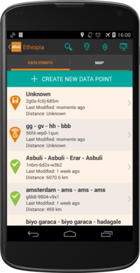

Data Sync and Storage
=====================

Data Sync
---------
If an internet connection is available, either through 3G or WiFi, data synchronisation happens automatically. No further steps are required from the user once the form is submitted. 

If an internet connection is not available, data will be stored on the device for later upload. After a form has been submitted, it is both stored in the internal database of the device, and **exported** to the sd-card. This makes it possible to directly retrieve the data from the sd-card, and do a *bulk upload* to the dashboard if necessary. If you need to perform a data *Bulk Upload*, please refer to the corresponding documentation in the **Dashboard** section: :ref:`bulk_upload_data`.

Data Point status
^^^^^^^^^^^^^^^^^
Each data point in the data point list is shown with an icon. There are three icons:

1. 'Saved' (orange with a disk icon) - this means that a form in the data point was started, but not submitted yet. The user needs to go back to the form, finish it, and submit it.
2. 'Exported' (orange with a connectivity icon) - this means that a form in the data point was submitted and exported to the sd-card, but not synced to the server yet. The device needs to have connectivity before it can sync the data.
3. Synced (green with a checkmark icon) - all submitted forms in the data point have been synced to the FLOW server correctly.

If there are multiple forms inside a data point, the icon used will display the 'worst case', meaning that if some of the forms are already synced, but one form is not synced, it will display the not-synced icon.

You can order the Data Point list according to the status, by selecting the *Status* option in the *Order By* menu option.

   Ordering the data points by status will put the most important ones (un-synced) at the top

It is extremely important that you check the synchronisation status before deleting data from the device. Otherwise you might lose data.

Data Storage
------------
All collected and submitted data is stored on the sd-card or internal storage of the device. 

The directory that holds all Akvo FLOW files is called *akvoflow*. You can find this folder while browsing the top-level directory of the external storage.

To interact with the data files, the app has two different folders inside *akvoflow*: *inbox* and *data*.

Inbox
^^^^^

The **inbox** directory where a user can manually put a form zip file, in case an internet connection is not available. How to generate form files is described in the **Dashboard** section: :ref:`manual_survey_transfer`. Once you have those files, just place them in this directory and open the app. The corresponding projects and forms should be synced now.

Data
^^^^
The **data** directory is the folder where all collected data is stored. All data files are stored here before they are sent to the server. When a form is *exported* after being submitted, it means that it corresponding files can be found here. If the automatic data sync is not available (i.e. no internet connection available), the data must be synced in a manual way, using **Bulk Upload**. A detailed description on how bulk upload works is presented in the **Dashboard** section: :ref:`bulk_upload_data`.

Data deletion
^^^^^^^^^^^^^
If you have been using the phones extensively, or for a previous data collection, it is probably a good idea to clean them up for the next data collection, to reclaim space. 

This is important because data is not automatically deleted by the app, so the *data* folder increases in size. We do this to protect data from accidental deletion. If the data folder becomes too large, the sd-card might run out of space. This can be checked here: :ref:`check_sd_card`.

In addition, a large data folder becomes a problem when bulk data upload is used. During bulk data upload, the whole data folder is uploaded, including all data that might have already been uploaded before. If the size becomes very large, this increases the risk of the bulk upload failing.

Before you delete data, you need to make sure that all data has been successfully submitted to the FLOW server. After that, you can take these steps to clean up the phone:

- backup the 'data' folder on a computer
- empty the 'data' folder
- empty the 'inbox' folder