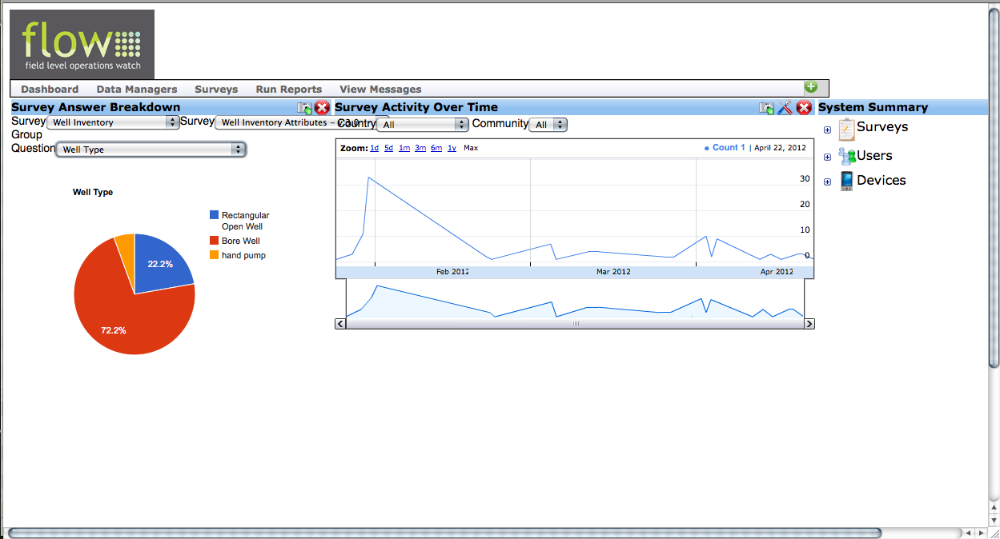
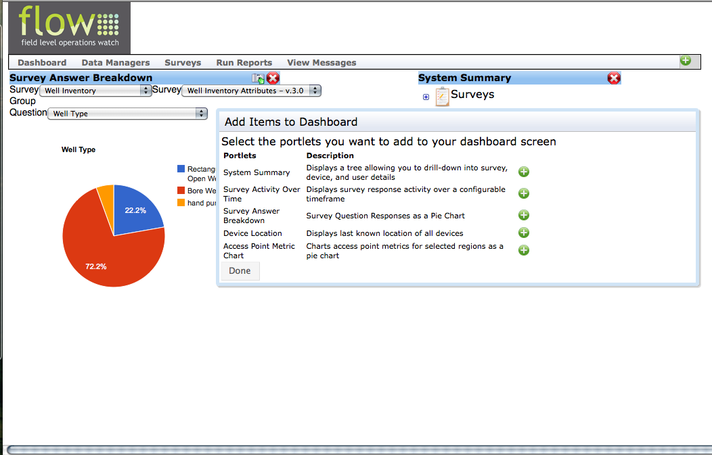
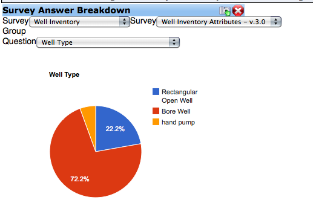
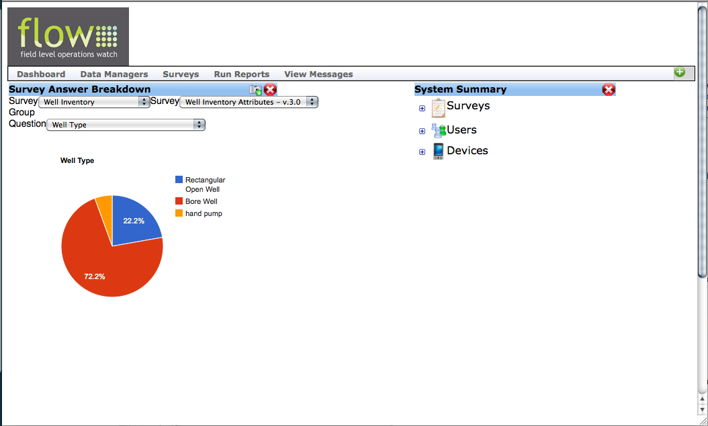

Overview
================

The FLOW Dashboard is the web-based location where users access and manage their FLOW data. All the data collected through FLOW is stored and processed in the Dashboard. It is also where users can run reports, create and edit surveys, and edit data. Each organization will have its own URL to access its online Dashboard, such as http://flowakvo.appspot.com/Dashboard.html.

   
The Dashboard is made up a series of pages. The first page you see after you log in is your Dashboard home page. Across the top bar there are a series of menu items:

	* Dashboard - brings the user back to the home page
	* Data Managers - menu of all data and survey management tools
	* Surveys - menu of tools for survey creation and management
	* Run Reports - menu of various reports that can be run with FLOW data
	* View Messages - screen to view messages related to status of surveys published on the Dashboard

Access to each tool menu is limited by permissions so not all functions will be available to all users. 

**Important - There is no "Back" button on the Dashboard!** 

All Dashboard pages are contained and displayed within your organizations Dashboard URL. This means that clicking your browser's "Back" arrow button will take you away from the Dashboard to whatever webpage you had previously visited before starting your Dashboard session. Instead, clicking on **Dashboard** will always bring you back to the Dashboard home. 
   
The Akvo FLOW Development Team frequently updates the Dashboard with new or enhanced features, so check our roadmap page for updates at www.akvo.org/web/flow [insert correct link]

 
   
Getting started with the Dashboard
-----------------

Gmail account
^^^^^^^^^^^^^^^^
The Dashboard is controlled by permissions and a free Gmail account is required in order to access the Dashboard. If you do not already have a Gmail account, go to https://www.google.com/accounts/NewAccount and create one and then email your Gmail username to a FLOW administrator and they will give you access to the Dashboard. 

Google Earth
^^^^^^^^^^^^^^^^
In order to view maps exported from the Dashboard you will need the free download of Google Earth from http://www.google.com/earth/download/ge/agree.html.

Java
^^^^^^^^^^^^^^^^
In order to run reports you will need to install a free version of Java from http://www.java.com/en/download/index.jsp .  

Customizing your Dashboard Home page
-----------------

The Dashboard home page (what you see when you first log in to your Dashboard) contains a variety of widgets that can be added or removed by the user according to their needs. Each time you log in, you will see the widgets you have previously selected to appear. 

Widgets can be added or removed from your view of the database and moved around to create a customized display for each user. Adding and removing widgets changes only your view of the dashboard and doesn’t affect any other users.

Available widgets for your home page
^^^^^^^^^^^^^^^^^^^^^^^^^^^^^^^^

The following widgets are currently available to add to your Dashboard Home page.

	* System Summary – shows existing surveys, users and phone addresses contained in the Dashboard.
	* Survey Activity over Time – shows how many surveys the database is receiving over a given period of time, results can be shown by country or globally.
	* Survey Answer Break Down – shows a pie chart of the percentages of answers given to a particular question in a survey. 
	* Device Location – shows the approximate location of each FLOW enabled phone as of the last time the phone was turned on, and a location beacon could be sent to the FLOW server.
	* Access Point Metric Chart - if you have created metrics for your FLOW surveys, charts access point metrics for selected regions as a pie chart *(currently under construction)*

Adding, moving, and deleting widgets
^^^^^^^^^^^^^^^^^^^^^^^^^^^^^^^^

To add a widget, click the green "+" on the far right of the menu bar, which will display a pop up window with the widget menu. Clicking the green "+" next to each widget will add it to your Home screen. When you are finished selecting the widgets you would like to display, clicking **Done** will dismiss the pop-up window.

[Insert image of widget pop up menu with arrow to green plus]

To move widgets around on your dashboard click and hold down the top bar of a widget and drag it to a new location. 

[Insert image of widget relocate with top widget bar highlighted]

To delete a widget you have previously selected, click the red "X" at the top right of that widget on Dashboard home.

[Insert image of widget delete]

