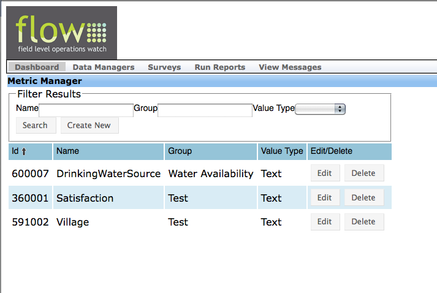
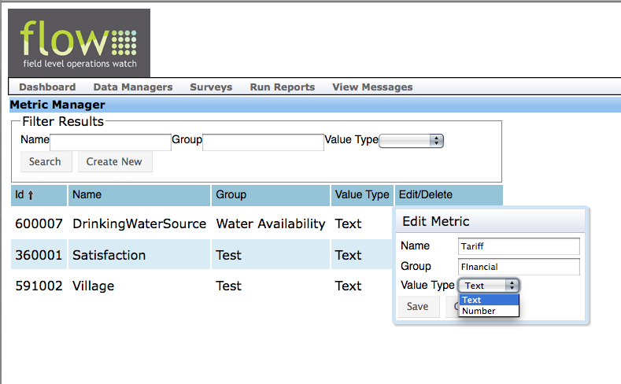
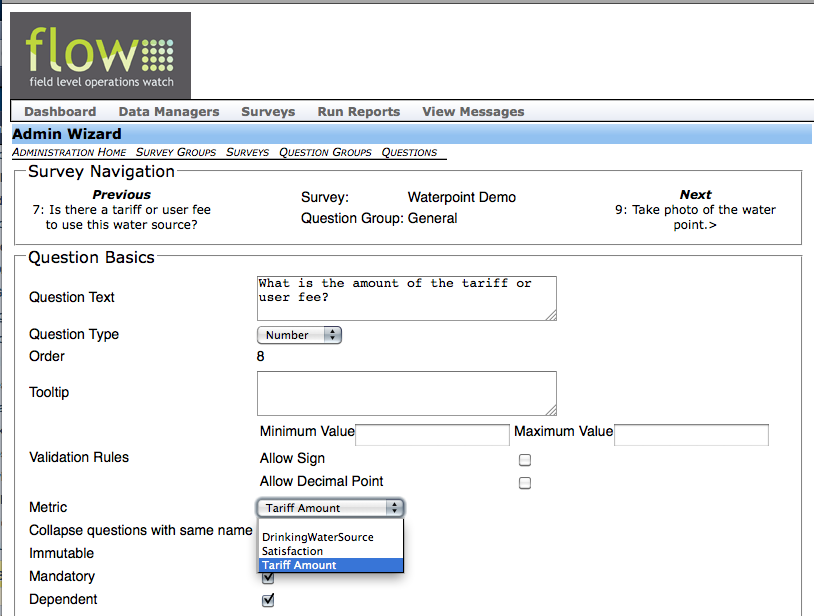
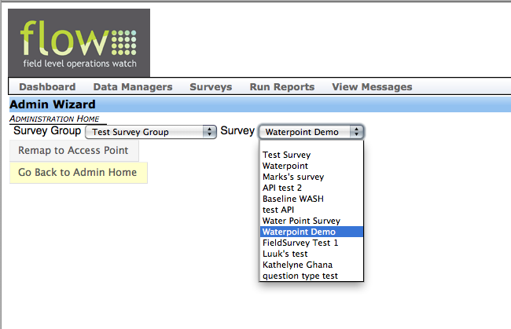
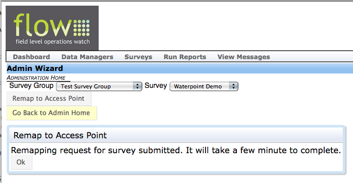

Mapping
================

When the Akvo FLOW team initially configures your FLOW Dashboard, by default your survey data will automatically publish to the external public map associated with your Dashboard (http://[yourinstancename].appspot.com), but the data will be shown in raw form in the map pop-up windows with no meaningful point symbol coding.

There are two additional details you must take care of to ensure that your data will publish on the maps (if your data are not showing, check these two details before contacting the Akvo FLOW support team):

   1. Make sure your survey is set to Point Type = Water Point.
   2. Make sure your Akvo FLOW administrator has added the country or countries in which your data are located to the dropdown box on the external Google Map.

Editing Your Akvo FLOW Maps
--------------------------------

To show a selection of data in your map pop-up windows, follow these steps:

**For a new survey:**

	1. Create metrics for the data you wish to see on your map using Metric Manager on the Dashboard.
	2. As you are creating the survey, assign the appropriate metric to the appropriate survey question using the Metric dropdown box on the Question Basics page for each survey question.
	3. Use the survey to collect and submit data from the field.
	4. Work with the Akvo FLOW support team to edit the template for your map's pop-up windows so that your data will display on your map as you wish to see it.
	
	
**For an existing survey:**

	1. Create metrics for the data you wish to see on your map using Metric Manager on the Dashboard
	2. Return to the Question Basics screen for each question you wish to apply a metric to, and assign the appropriate metric to the appropriate survey question using the Metric dropdown box on the Question Basics page for each survey question.
	3. Once you have finished assigning metrics, run Remap to Access Point from the Data Managers menu on the Dashboard.
	4. Work with the Akvo FLOW support team to edit the template for your map's pop-up windows so that your data will display on your map as you wish to see it.
	
	Each step is described in greater detail below.

Creating Metrics
-------------------------

1. Go to the Data Managers menu from the top menu bar on the Dashboard and select Metric Manager. Here you will see any metrics that have already been created in your Dashboard. 

   The Metric Manager tool on the Dashboard.

2. To create a new metric, click the **Create New** button in the Filter Results box. A pop-up window will appear where you can edit the details of the metric.

In the **Name** text field, enter the name of the metric you wish to create. Example: TariffAmount.

In the **Group** text field, enter the name of the group you want this metric to be a part of. The group designation is only to help you keep your metrics organized on your Dashboard.

In the **Value Type** dropdown box, select from either *Text* or *Number*. Select *Text* if the metric data will be text (for example, a word or phrase, or a mix of letter and numbers); select *Number* if the metric data will be a number (for example, a year, a monetary amount, or any other number answer).

Click **Save** when you are finished. Click **Close** at anytime to dismiss the box (clicking Close without clicking Save will not save your work).

Repeat this process for each metric you wish to create.

To edit a metric, click the **Edit** button to the right of the metric name.

To delete a metric, click the **Delete** button to the right of the metric name. Once you delete a metric, it cannot be undone.

   Creating or editing a metric on the Dashboard.

Assigning Metrics to Survey Questions
----------------------------------------

Once you create metrics in Metric Manager, you must then assign them to survey questions in order to link the survey data with the metrics for mapping and reporting.

To assign metrics to survey questions, enter the **Question Basics** page for the survey question you wish to assign a metric to. From the **Metric** dropdown box, select the metric to assign to the question.

   Creating or editing a metric on the Dashboard.
   
Be sure to save your selection using one of the green Save buttons at the bottom of the Question Basics screen. Repeat this process for each metric you wish to assign to a survey question.

Running Remap to Access Point
-------------------------------

This tool is used only when you are adding or editing metrics for a survey that you have already started to use to collect data. Remap to Access Point re-runs the access point mapping for a single survey. It's useful if the mapping or the metrics changed after some data for a survey has been submitted.

From the Data Managers menu, select Admin Wizard. From Admin Wizard home, select Remap to Access Point.

From the **Survey Group** dropdown, select the survey group that contains the survey in which you assigned new metrics. From the **Survey** dropdown, select the survey.

   Running Remap to Access Point on an existing survey to update metrics.
   
Once you have made your selections, click **Remap to Access Point**. A confirmation message will appear to tell you that your request has been submitted. Wait several minutes before proceeding to allow the process to run.
   

   The confirmation message that appears after clicking *Remap to Access Point*

Heading 5
-------------------------------

Text

Heading 6
------------------------------

Text