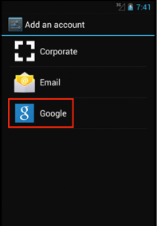
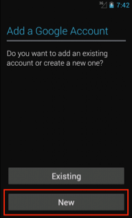
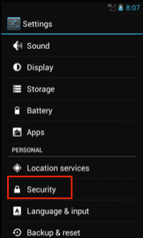
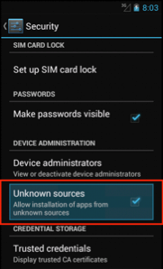
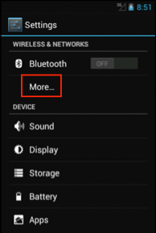
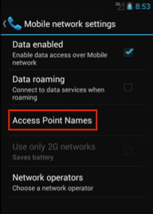
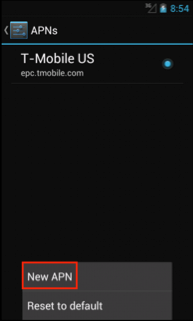
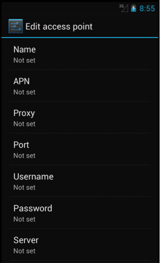
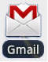
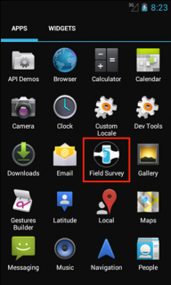

Preparing your device for FLOW 
=================================

Before you install the Field Survey App
------------------------------------------
Before you install the Field Survey App on your phone, ensure that your phone is in proper working condition. Place the SD card, the SIM card, and the battery in the phone and make sure you can send and receive calls and data. Once this is done, ensure that your phone is configured to do the following:

• 	`Configure Gmail on the phone <http://flow.readthedocs.org/en/latest/docs/topic/fieldapp/2-preparing-device.html#configure-gmail-on-phone.html>`_  
•	`Configure Android settings for software download <http://flow.readthedocs.org/en/latest/docs/topic/fieldapp/2-preparing-device.html#configure-android-settings-for-software-download.html>`_ 
•	`Set up Wi-Fi <http://flow.readthedocs.org/en/latest/docs/topic/fieldapp/2-preparing-device.html#set-up-wi-fi.html>`_ 
•	`Set Access Point Name (APN) <http://flow.readthedocs.org/en/latest/docs/topic/fieldapp/2-preparing-device.html#set-access-point-name-apn.html>`_ 
•	`Calibrate GPS <http://flow.readthedocs.org/en/latest/docs/topic/fieldapp/2-preparing-device.html#setting-data-and-time-on-the-phone.html>`_ 

How to do this is described in the sections below.

Configure Gmail on phone
~~~~~~~~~~~~~~~~~~~~~~~~~~~
A free Gmail account is necessary to install the Field Survey App, and to receive updates.  

It is best to use a dedicated email address for communication with the phone. If you intend to use multiple phones with the Field Survey App, use the same email address for all the phones, so that you can send software updates to all the phones simultaneously. If you are an enumerator, it is likely that the phone is already set up correctly.

**To configure Gmail on the phone:**

1. From the home screen of the phone, go to the **settings** menu by clicking on the menu button on the phone (usually at the bottom left, but can be in different places depending on the model of the phone). 

2. Under **Accounts & Sync** or **Accounts**, press **Add account**.

   
3. From the list of options, select **Google**. 

   
4. You are prompted to specify whether you want to create a new Google account or use an existing one. If you already have a Gmail account that can be dedicated for communication with the FLOW server, choose **Use an existing one**. Otherwise, choose **New**.  

5. Follow onscreen prompts to create your Google account.

The new account will now be visible under **Applications > Email**.

Configure Android settings for software download
~~~~~~~~~~~~~~~~~~~~~~~~~~~~~~~~~~~~~~~~~~~~~~~~~~~~~~
Your phone must be configured to allow download and installation of third-party software, so that you can download and install the Field Survey App, and other recommended software.

**To enable software download:**

1.	Under **Settings**, select **Security**.

   
2.	Enable **Unknown Sources**. If you cannot find the **Unknown Sources** option under **Security**, check under **Applications**.

Set up Wi-Fi
~~~~~~~~~~~~~~~~~~~~~~~~~~~
In order for the phone to update surveys, receive new surveys or transmit submitted surveys, the phone must have a cellular plan with data or must be connected to Wi-Fi. A Wi-Fi internet connection is the easiest way to connect to the FLOW server for data exchange.

**To connect the phone to a Wi-Fi network:**

1.	On the home screen of the phone, press **Settings**. 

2.	Under **Wireless and Network**, the default setting for Wi-Fi is **OFF**. Tap on **OFF** to change it to **ON**. 

3.	Select **Wi-Fi**. A list of available Wi-Fi networks displays. 

4.	Choose the network you have access to and provide the password, if prompted. 

5.	Select **Connect**. When connected to Wi-Fi, you can see this Wi-Fi icon at the top of the screen:

.. figure:: img/wifi_icon.png
   :width: 30 px
   :alt: image of phone
   :align: center

*Note: In situations where an internet or data connection is unavailable you need to setup data collection via Mobile networks (H, 3G, E, G). To do this you need to enable ‘Use packet data’ or ‘Data roaming’.*

Set Access Point Name (APN)
~~~~~~~~~~~~~~~~~~~~~~~~~~~~~~~~~~
Depending on your situation, this section may not be necessary. If your data plan is already working for your phone, you can skip this.

Local Internet service providers use APN settings to activate data plans using SIM cards on phones that were purchased abroad. Every service provider has different APN settings and they change these settings periodically for security reasons. When you purchase the SIM cards, ask the Internet Service Provider to give you the correct APN settings for the SIM Card.

**To set the Access Point name:**

1.	On the home screen, press **Settings**. 

2.	From the options, choose **More…** and then select **Mobile Networks**.

3.	Select **Access Point Name**.

4.	Press the **Menu** button and select **New APN**.

   
5.	Fill in the required APN settings for your SIM card. You can get the correct APN settings for the SIM Card from your Internet Service Provider.

   
6.	Press the **Home** key when you are done.   
   
   
Setting data and time on the phone
~~~~~~~~~~~~~~~~~~~~~~~~~~~~~~~~~~~~~~~~~~
Before you start collecting data, it is important to check it the date and time are set correct. The date and time stamp on each data submission takes this information from the phone. If it is set incorrectly, you will get errant date/time stamps. 

**To set date and time:**

1.	On the home screen, press **Settings**. 
2.	Click **date and time**.
3.	Check if the date and time are correct, otherwise change. 

Installing Field Survey App
------------------------------
To install the Field Survey App on the phone, you need the latest available version of the installer file. The file extension of the installer file is **.apk**. The project manager will send this file as an email attachment to the email address you set up in the previous step.

**To install the Field Survey App:**

You may first need to change a security setting to allow apps for a source other than Android Market (Play Store) to be installed. To do this, tap on the Menu button and select **Settings**. Select **Applications**, and enable **Unknown Sources**. Sometimes, this setting is found under **Security**.

1.	Open the Gmail app on your phone 

2.	Check if the email with the app has arrived

3.	Open the email and scroll down. You should see a button **Install**.

4.	Click **Install**. Click **Ok** to allow the app to be installed on the phone.

*Note: If you receive an error during installation, you may have to uninstall the existing application before replacing it with the new one.*

Create shortcut
~~~~~~~~~~~~~~~~~~~~~~~~~~~~~~~~~~~~~~~~~~
For easy access, create a shortcut to the Field Survey App on the home screen. 

**To create a shortcut:**

1.	Click on the **Applications** icon on the phone home screen. 

2.	From the list of applications, press and hold on the **Field Survey** icon. 

3. 	The shortcut to the Field Survey App icon now appears on your home screen.

Install recommended applications
~~~~~~~~~~~~~~~~~~~~~~~~~~~~~~~~~~~~~~~~~~
It is recommended that you install certain applications in addition to the Field Survey App, in order to enhance productivity. These are several such useful applications available for **free download** on the internet. 

Recommended applications:

•	`ASTRO File Manager <https://play.google.com/store/apps/details?id=com.metago.astro/>`_. - can be used as a backup option to install and update the Field Survey App, when the email method does not work. 
•	`GPS Status & toolbox <http://www.androiddrawer.com/203/download-gps-status-toolbox-3-8-1-app-apk/#.Ue-XIhY72p2/>`_ - enables you to monitor and check the GPS function of the phone. 
•	`Quickmark <http://download.pandaapp.com/android-app/quickmark-barcode-scanner4.1.2-id5129.html#.Ue-XVBY72p0/>`_ or `ZXing Barcode Scanner <https://play.google.com/store/apps/details?id=com.google.zxing.client.android&hl=en/>`_ - required if barcodes are part of your survey. 

You can install these apps by going to 'Google Play', search for the apps, and install them.

Adjust camera resolution
~~~~~~~~~~~~~~~~~~~~~~~~~~~~~~~~~~~~~~~~~~
The resolution of the photos determines how much time it will take to upload. The smaller the size, the better. Choose the lowest setting that is available on your phone. Here is how to do that:

1.	Go to the **Camera app**

2.	In the Camera app, go to the **settings** menu. 

   
3.	Use the buttons on the right to find the **Resolution** setting, and set it to the lowest your phone supports (in this case, 640x480, but sometimes also 320x240).    
   

   
4.	In addition, there is a setting in the preferences that you can use to shrink photos automatically. This can be used in addition to the resolution setting. To do this, from the Field Survey home screen, select **settings**, then **preferences**. Scroll all the way down, and enable the setting **Shrink large photos**. This will automatically shrink photos to 320 x 240 pixels before upload.   
