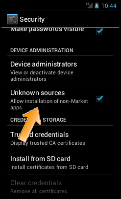
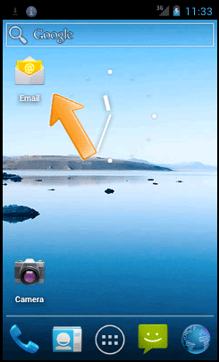
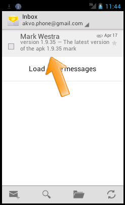
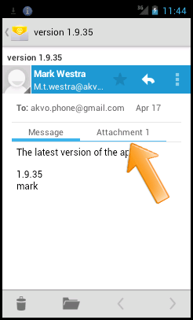
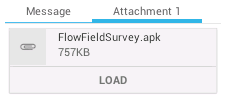
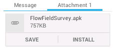

.. _installing-app:

Installing the Field Survey app
=================================

There are different ways to install the Field Survey app on the phone. In future versions of Akvo FLOW, it will become possible to download the application from the Android Market (now called Google Play), but currently that is not yet possible.

**Android settings** - All of the methods outlined below require a change in the Android settings. The change will allow the installation of applications from other sources then the Android Market. To do this, click on the Menu button and select 'Settings'. Select 'Applications', and enable 'Unknown Sources'. Sometimes, this setting is found under "Security".

Installation through Gmail
---------------------------
This is the easiest way to get the application on the phone. Don't forget to change the Android settings, see above. These are the steps:

1. Configure email on the phone. You will need to use a gmail account - other email addresses such as hotmail, won't work. It is advisable to use a special email address for this, which is only used to communicate with the phone. If you have multiple phones with the Field Survey app, the same email address can be used for all. In that way, you can send updates to the software to all phones in one go.

2. Get the right Field Survey app (APK file) for your Dashboard. Be careful to get the right one: the Field Survey app and the Dashboard are connected, so you can't simply use any Field Survey APK file for this. You can download the latest version of the APK for your organisation from the Dashboard you have access to, at (XXX-location in Dashboard-XXX) 
 
3. Send an email with the Field Survey app (APK file) as an attachement to the gmail email address that is configured on the phone.

4. Open the email app on the phone. If you don't have the email app icon on your home screen, you can `create a shortcut <create_shortcut>`. 

Locate the mail.

5. Open the mail. The APK file will be shown as an attachment. The way attachements are shown will depend on the email app.

5. Click "Install". Sometimes you have to click 'Load' first.
	

   

   
The Field Survey app is now installed on the phone. You can now create a shortcut to the Field Survey app on the home screen. This will make starting up the app during field work easier. To do this, just long press on an empty home screen space and choose "Shortcuts" from the menu. Select "Applications", and select the Field Survey app. This will place a shortcut to the Field Survey app on your home screen.

Installation through the FileManager
--------------------------------------

Installation through the Terminal
-----------------------------------