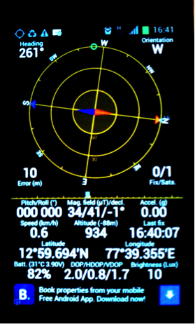

Launching the Field Survey app
==============================
Before you start using the Field Survey App, you must do the following on your phone:

•	Connect the phone to a Wi-Fi network or mobile data connection.
•	Set the Access Point Name (APN) 

**To start the application:**
On the home screen, click on the **Field Survey** icon. 

.. figure:: img/3-0launch_field_survey_app.png
   :width: 200 px
   :alt: image of phone
   :align: center

Set up device ID
----------------
Provide a name (Device ID) for the phone. This name will be used to identify the phone on the FLOW Dashboard. 

**To set up device ID:**

1.	Click on the **Settings** icon on the main screen. From there, select **Preferences**.
2.	Click the **device identifier** option. You will be asked for authentication, which is "12345". In the next screen, enter the device ID (for example, cardno24), avoiding tabs, spaces or special characters. The device Id will be provided by the project manager.
3.	Click **ok**.

Set up users
------------

**Creating user**

Before you start using FLOW, you first need to create one or more users. During data collection, a specific user needs to be selected so that you can later track the collected data to the field worker who conducted the survey. 

The **Manage Users** feature allows you to create and edit users, and select a particular user for a session. 

Tap the **Users** icon IMAGE manage_users.png to enter the user management screen. Once there, tap the Menu button and select Add User, and provide a name and email address.  Once you have created the user, tap save. The new user shows up in the list of users. 

**Selecting user**

After you have created one or more users, you can select the user by tapping the name. 

IMAGE
   
The selected user is displayed at the top of the main menu screen. 

IMAGE

**Editing user**

To edit a user long-click the username you want to edit. Select **edit user**.

IAMGE

Now you can edit the name and email address. When you’re done, click **save**. 

IMAGE

**Deleting user**

To delete a user long-click the username you want to delete. Select **delete user**. 

IMAGE

You have deleted the user and the name doesn’t appear anymore in the **Manage Users** feature.  

**Remember user**

If you want the system to remember the selected user the next time you open the app, select the user you want to be remembered. Then click the **Settings** icon on the main screen. From there, select **Preferences** and then tap the checkbox beside the “Keep the last selected user logged in between sessions” option.

IMAGE

Updating Field Survey app
-------------------------
Whenever a software update becomes available, it is recommended that you download and install the update on your phone. The dashboard administrator or Akvo staff can tell you which APK version you should use. 

**To check which version you are currently using:**

1.	Open the **Field Survey App**.
2.	Press **settings**.
3.	Scroll down to About. Click **About**.
4.	Here you can see which **version** is currently installed.

If you are using an old APK version, you need too **install the update**:

1.	Get the latest version of the APK file through email as described here, and click **Install**. 
2.	You are prompted to specify whether you want to replace the existing Field Survey App. Choose **OK**.
3.	Click **Install**. The new version of the application is installed. 
4.	A confirmation message appears. Click **Done**.

Check SD card status
--------------------
Before you start data collection, you need to check if there is enough space available on your SD card. 

We recommend that at least 2 GB is available. However, 4 GB will be better if you need to collect photos as well. 

**To check how much space is left on your SD card:**
1.	In the home screen click **preferences**.
2.	Click **SD card and storage**.
3.	Here you can see how much is the **total space** and **available space**.

Calibrate GPS
-------------
Every time the phones are moved more than 600 miles (500 kilometers) from the last location where they were calibrated, the GPS system needs to be re-calibrated to ensure GPS coordinates are accurate. The calibration can be done with or without a SIM card in the phone.

If the SIM cards and APN are set correctly on the phone, the calibration process takes only a few minutes. If these are not set correctly, it can take up to 30 minutes.
 
You need to install the free App ‘GPS Status & Toolbox’ from the Playstore. 

**To calibrate GPS:**

1.	Take the phone outside to a location where there is a clear view of the sky. It makes no difference whether the sky is cloudy or clear.
2.	On the phone home screen, click the GPS Status icon IMAGE 3-3GPS_icon.png.
3.	If your GPS is disabled, you are prompted to enable GPS. Select **Use GPS Satellites** and then return to the previous screen. The GPS application appears.

   
4.	Wait until the margin of error appears and is between 5 and 10 meters. This can take anywhere from 30 seconds to 30 minutes. 

---

old content from 3-1 launching survey app
=========================================

When you have installed the Field Survey app sucessfully, it is ready to be launched. These are the steps:

.. _create-shortcut:

1. **Placing an icon on the home screen** - Make sure the Field Survey app icon is visible on the home screen. This will make starting up the app during field work easier. To do this, just long press on an empty home screen space and choose "Shortcuts" from the menu. Select "Applications", and select the Field Survey app. This will place a shortcut to the Field Survey app on your home screen.
	
2. **Launching the app** - Click on the Field Survey app icon to launch the application.
	
.. figure:: img/5-launching-app-1-arrow.gif
   :width: 200 px
   :alt: image of phone
   :align: center	
   
3. When opened, the main menu of the Field Survey app looks like this:
  
.. figure:: img/5-launching-app-2.png
   :width: 200 px
   :alt: image of phone
   :align: center  
   
   
Providing a Phone ID
----------------------
Once the application is opened for the first time, you need to set a name for the phone. This name will show up in the Dashboard, and will be used to identify the phone. These are the steps:

1. Select "Settings" in the main menu of the survey app.

.. figure:: img/5-launching-app-3-arrow.gif
   :width: 200 px
   :alt: image of phone
   :align: center
   
2. Select "Preferences" at the top of the list

.. figure:: img/5-launching-app-4-arrow.gif
   :width: 200 px
   :alt: image of phone
   :align: center

3. Scroll down the list to the bottom. Select "Device ID".

.. figure:: img/5-launching-app-5-arrow.gif
   :width: 200 px
   :alt: image of phone
   :align: center
   
4. An "Authorization Required" popup shows up. Type the administrator passcode, which is 12345. Click "Ok".

.. figure:: img/5-launching-app-6.png
   :width: 200 px
   :alt: image of phone
   :align: center

5. Provide a name that will help you find back the phone in the Dashboard. Click "Ok".

.. figure:: img/5-launching-app-7.png
   :width: 200 px
   :alt: image of phone
   :align: center

Creating a user
-------------------
When the Field Survey app is first opened, you first need to create one or more users. During data collection, a specific user is always selected. When you later examine the data in the Dashboard, you will be able to see who collected a particular piece of data.

To create a user, follow these steps:

1. Select "Manage Users" on the main menu. The current list of users will be displayed. At first, this will be empty.

.. figure:: img/7-manage-users-0-arrow.gif
   :width: 200 px
   :alt: image of phone
   :align: center	
	

2. While in the Manage Users screen, press the Menu button of the phone. This will display the "Add User" button.

.. figure:: img/7-manage-users-1-arrow.gif
   :width: 200 px
   :alt: image of phone
   :align: center	

3. Select "Add User"

4. Fill in the name of the user and an email address, and select "Save".

.. figure:: img/7-manage-users-2.png
   :width: 200 px
   :alt: image of phone
   :align: center	

5. The new user now shows up in the list of users. Click on the name to select the user.

.. figure:: img/7-manage-users-3-arrow.gif
   :width: 200 px
   :alt: image of phone
   :align: center

6. The selected user is now displayed at the top of the main menu screen.

.. figure:: img/7-manage-users-4-arrow.gif
   :width: 200 px
   :alt: image of phone
   :align: center

Old content from 3-2 setting up users
=====================================

Selecting a user
-------------------
To select a user, select "Manage Users" from the main menu. This will display a list of users.
Click on a name in the list to select the user.

.. figure:: img/7-manage-users-3-arrow.gif
   :width: 200 px
   :alt: image of phone
   :align: center

The selected user is now displayed at the top of the main menu.

.. figure:: img/7-manage-users-4-arrow.gif
   :width: 200 px
   :alt: image of phone
   :align: center

Editing a user
------------------
To edit a user, select "Manage Users" from the main menu. This will display a list of users. Long-click on one of the usernames, and select "Edit user". 

.. figure:: img/7-manage-users-5-arrow.gif
   :width: 200 px
   :alt: image of phone
   :align: center

Change the name and email address as desired, and click "Save" to save the changes.

.. figure:: img/7-manage-users-6.png
   :width: 200 px
   :alt: image of phone
   :align: center

Deleting a user
-----------------
To delete a user, select "Manage Users" from the home screen. This will display a list of users. Long-click on one of the usernames, and select "Delete user". The user is now deleted. 

.. figure:: img/7-manage-users-5a-arrow.gif
   :width: 200 px
   :alt: image of phone
   :align: center

Remember a user
------------------
By default, every time the application is launced, a user needs to be selected. If you prefer that the application remembers the last user selected, take these steps:

1. Select "Settings" from the main menu.

.. figure:: img/7-manage-users-7-arrow.gif
   :width: 200 px
   :alt: image of phone
   :align: center

2. Select the "Preferences" option.

.. figure:: img/7-manage-users-8-arrow.gif
   :width: 200 px
   :alt: image of phone
   :align: center
   
3. Check the box beside the "Keep the last selected user logged-in between sessions" option.

.. figure:: img/7-manage-users-9-arrow.gif
   :width: 200 px
   :alt: image of phone
   :align: center

old content from Updating the Field Survey app
==============================================

Occasionally, the software in the Field Survey needs to be updated. The easiest way to do the update is by using the Gmail account that you installed on the phone (see :ref:`installing the Field Survey app <installing-app>`). However, in cases of limited connectivity, a number of alternatives are described below.

Updating through Gmail
---------------------------

1. If you have not already done so: configure email on the phone. You will need to use a gmail account - other email addresses such as hotmail, won't work. It is advisable to use a special email address for this, which is only used to communicate with the phone. If you have multiple phones with the Field Survey app, the same email address can be used for all. In that way, you can send updates to the software to all phones in one go.

2. Get the right Field Survey app (APK file) for your Dashboard. Be careful to get the right one: the Field Survey app and the Dashboard are connected, so you can't simply use any Field Survey APK file for this. You can download the latest version of the APK for your organisation from the Dashboard you have access to, at (XXX-location in Dashboard-XXX) 
 
3. Send an email with the Field Survey app (APK file) as an attachement to the gmail email address that is configured on the phone.

4. Open the email app on the phone. If you don't have the email app icon on your home screen, you can :ref:`create a shortcut <create-shortcut>`. 

.. figure:: img/3-installing-app-2-arrow.gif
   :width: 200 px
   :align: center

Locate the mail.

.. figure:: img/3-installing-app-3-arrow.gif
   :width: 200 px
   :align: center

5. Open the mail. The APK file will be shown as an attachment. The way attachements are shown will depend on the email app.

.. figure:: img/3-installing-app-4-arrow.gif
   :width: 200 px
   :align: center

5. Click "Install". Sometimes you have to click 'Load' first.
	
.. figure:: img/3-installing-app-5.png
   :width: 200 px
   :align: center
   
.. figure:: img/3-installing-app-6.png
   :width: 200 px
   :align: center
   
6. You will see a popup that asks if you would like to replace the application. Click "Ok".
   
.. figure:: img/4-update-app-1.png
   :width: 200 px
   :align: center
   
7. You will see a popup that aks if you want to install the application, with a list of services the application will use. Click "Install"

.. figure:: img/4-update-app-2.png
   :width: 200 px
   :align: center
    
   
The Field Survey app is now installed on the phone. You can now create a shortcut to the Field Survey app on the home screen. This will make starting up the app during field work easier. To do this, just long press on an empty home screen space and choose "Shortcuts" from the menu. Select "Applications", and select the Field Survey app. This will place a shortcut to the Field Survey app on your home screen.

**Troubleshooting** - Sometimes, the previous step will not work, and you will get this message instead:

.. figure:: img/4-update-app-3.png
   :width: 200 px
   :align: center

In that case, you first need to remove the old Field Survey app before you can install the new one.

To remove the old application, take these steps:

1. On the home screen, click the Menu button. On the displayed popup, select "Manage Apps". On some phones, you have to select "Settings", followed by "Applications", followed by "Manage Applications" to arrive in the same menu.

.. figure:: img/4-update-app-4-arrow.gif
   :width: 200 px
   :align: center

2. Scroll down the list and locate the Field Survey app. Click on the icon.

.. figure:: img/4-update-app-5-arrow.gif
   :width: 200 px
   :align: center

3. Information on the application is displayed. Click on "Uninstall"

.. figure:: img/4-update-app-6-arrow.gif
   :width: 200 px
   :align: center

4. Confirm the uninstall by clicking "Ok".

.. figure:: img/4-update-app-7.png
   :width: 200 px
   :align: center

The Field Survey app will now be uninstalled. Now you can install the new application by following the steps above.

Updating through the FileManager
--------------------------------

Updating through the Terminal
-----------------------------

