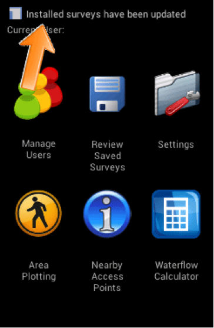
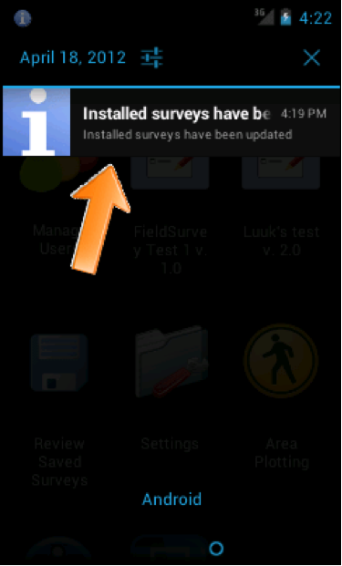
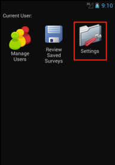
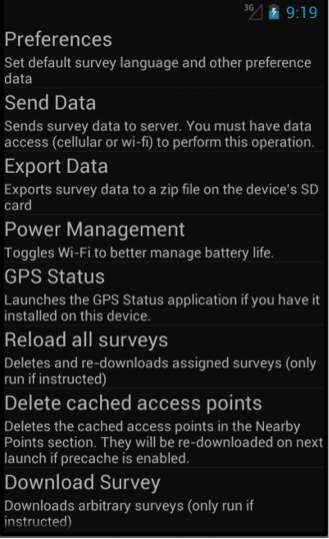
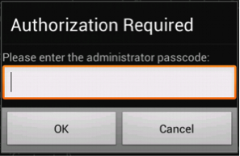
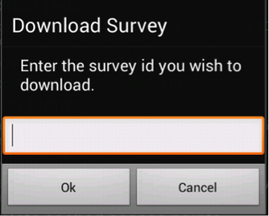

Getting FLOW surveys on to the device
=====================================
If you have successfully installed the Field Survey App on the phone and have internet or network connectivity, your phone is ready to receive surveys. 

*Note: It is important to know that you should close and open the App, the connection will be refreshed. If FLOW doesn’t work, you can try refresh the connection. This often helps.*

**There are four ways to get a survey from the FLOW server onto your phone:**

•  Automatic download: Assign a survey to your phone from the FLOW Dashboard, which will then be downloaded by the phone automatically. Survey assignment is done by the project manager. 
•	Reload all Survey: By reloading all surveys, the application tries to connect to the server and update with the latest version. If this doesn’t work, you need to download survey from settings menu. 
•	Download survey from settings menu: Download a specific survey from the Settings menu on the Field Survey App installed on your phone.
•	Manual transfer (bootstrap): Generate a bootstrap file containing the survey from the FLOW Dashboard and manually transfer the survey to your phone using a USB cable. This is also done by the project manager. 

Automatic download (create survey assignment)
---------------------------------------------
Every time the Field Survey App is launched, it checks for newly assigned surveys and updates to existing surveys. If there are new or updated surveys available, these are downloaded automatically. When new or updated surveys have been downloaded, the status bar shows a notification. This is the easiest way to get a survey to the phone.

When you launch the application, the phone sends a signal to the web-based FLOW Dashboard to indicate that your device is available for survey assignments. On the Dashboard, the project manager can assign a survey or set of surveys to the device. Assigned surveys are automatically downloaded from the FLOW server when your phone is turned on, provided you have internet or network connectivity. Shortcuts to these surveys appear on the Field Survey home screen.  

You can see the full notification by drawing down the status bar (put your finger on the top of the screen and slide downwards. Slide upwards again to close the notification screen).

Reload all surveys
------------------
If you have tried the automatic download, but they survey doesn’t show up, you can try to **reload all surveys**: 

1. Close and open the application. By doing this, the application tries to connect to the server and update with the latest version. 
2.	If this doesn’t work, you need to manual download survey from settings menu. 

Manual download from settings menu
----------------------------------
**To download a specific survey:**

Before you start, you need the ID of the survey. On the dashboard, you can find this if you view the details of the survey. 
1.   On the Field Survey home screen, click **Settings**. 

2.   From the list, select **Download Survey**.

3.   Enter the Authorization passcode **12345** and click **OK**.

4.   Enter the Survey ID of the survey you wish to download and click **OK**.

5.   The shortcut to the downloaded survey appears on the Field Survey home screen. Use the shortcut to launch the survey.

*Note: If the downloaded survey does not appear immediately on the home screen, close the application and reopen it.*

Manual transfer (bootstrap)
---------------------------
Manual Survey Transfer (formerly known as bootstrap) allows you to generate a file of a FLOW survey you've already published that you can email to yourself or your colleagues to install on devices manually, in situations with low or no connectvity to a wireless or mobile network. How to do this is described in the `Manual survey transfer section <http://flow.readthedocs.org/en/latest/docs/topic/dashboard/3-devices.html#manual-survey-transfer.html>`_ of the Akvo FLOW dashboard documentation.
