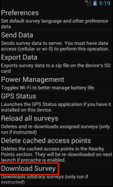

Getting FLOW surveys on to the device
=====================================
If you have successfully installed the Field Survey App on the phone and have internet or network connectivity, your phone is ready to receive surveys. 

*Note: It is important to know that you should close and open the App, the connection will be refreshed. If FLOW doesn’t work, you can try refresh the connection. This often helps.*

**There are four ways to get a survey from the FLOW server onto your phone:**

•  Automatic download: Assign a survey to your phone from the FLOW Dashboard, which will then be downloaded by the phone automatically. Survey assignment is done by the project manager. 
•	Reload all Survey: By reloading all surveys, the application tries to connect to the server and update with the latest version. If this doesn’t work, you need to download survey from settings menu. 
•	Download survey from settings menu: Download a specific survey from the Settings menu on the Field Survey App installed on your phone.
•	Manual transfer (bootstrap): Generate a bootstrap file containing the survey from the FLOW Dashboard and manually transfer the survey to your phone using a USB cable. This is also done by the project manager. 

Automatic download (create survey assignment)
---------------------------------------------
Every time the Field Survey App is launched, it checks for newly assigned surveys and updates to existing surveys. If there are new or updated surveys available, these are downloaded automatically. When new or updated surveys have been downloaded, the status bar shows a notification. This is the easiest way to get a survey to the phone.

When you launch the application, the phone sends a signal to the web-based FLOW Dashboard to indicate that your device is available for survey assignments. On the Dashboard, the project manager can assign a survey or set of surveys to the device. Assigned surveys are automatically downloaded from the FLOW server when your phone is turned on, provided you have internet or network connectivity. Shortcuts to these surveys appear on the Field Survey home screen.  

.. figure:: img/4-1automatic_download_installed_surveys_updated.png
   :width: 200 px
   :alt: image of phone
   :align: center

You can see the full notification by drawing down the status bar (put your finger on the top of the screen and slide downwards. Slide upwards again to close the notification screen).

.. figure:: img/4-1automatic_download_installed_surveys_updated2.png
   :width: 200 px
   :alt: image of phone
   :align: center

Reload all surveys
------------------
If you have tried the automatic download, but they survey doesn’t show up, you can try to **reload all surveys**: 

1. Close and open the application. By doing this, the application tries to connect to the server and update with the latest version. 
2.	If this doesn’t work, you need to manual download survey from settings menu. 

Manual download from settings menu
----------------------------------
**To download a specific survey:**

Before you start, you need the ID of the survey. On the dashboard, you can find this if you view the details of the survey. 
1.   On the Field Survey home screen, click **Settings**. 

2.   From the list, select **Download Survey**.

3.   Enter the Authorization passcode **12345** and click **OK**.

4.   Enter the Survey ID of the survey you wish to download and click **OK**.

.. figure:: img/4-3enter_survey_ID.png
   :width: 200 px
   :alt: image of phone
   :align: center

5.   The shortcut to the downloaded survey appears on the Field Survey home screen. Use the shortcut to launch the survey.

*Note: If the downloaded survey does not appear immediately on the home screen, close the application and reopen it.*

Manual transfer (bootstrap)
---------------------------
REFER TO DASHBOARD PART CAETIE??????

---

old content from 4-1 Getting surveys on the phone 
=================================================

Automatic download of surveys
-----------------------------
1. If you have sucessfully installed the Field Survey app on the phone, and you have a wifi connection, the phone will send a 'beacon signal' to the web-based Dashboard. In the Dashboard, surveys can then be assigned to the phone (XXX-reference-needed-XXX). If this proces fails, please consult the troubleshooting guide (XXX-reference-needed-XXX)

2. Every time the Field Survey app is launched, the application checks for new surveys assigned to it, or updates of existing surveys. If there are new or updated surveys available, it will download them automatically. When new or updated surveys have been downloaded, the status bar will show a notification. 

.. figure:: img/6-getting-survey-1-arrow.gif
   :width: 200 px
   :align: center
   
You can see the full notification by drawing down the status bar (put your finger on the top of the screen and slide downwards. Slide upwards again to close the notification screen).

.. figure:: img/6-getting-survey-2-arrow.gif
   :width: 200 px
   :align: center
   
3. The surveys are not displayed immediately. You need to close the application and reopen it. After reopening, the downloaded survey will be shown in the main menu. Sometimes you will need a few attempts before the surveys show up.   

.. figure:: img/6-getting-survey-3-arrow.png
   :width: 200 px
   :align: center
   
   The survey has been downloaded and is ready to be used.
      
   
Alternative - manual transfer of surveys
----------------------------------------
If there is no wifi available or you have trouble with the connectivity, you can put the survey on the phone using a manual method. This method takes 3 steps: 1) exporting the survey from the Dashboard to a "Bootstrap file", 2) connecting the phone to a computer, 3) transfering the bootstrap file to the phone.

1. Exporting the survey to a bootstrap file
*******************************************
1. Open the Dashboard on your computer

2. In the menu item "Data Managers", select "Admin Wizard". 

3. Select "Generate Bootstrap File" from the list.

.. figure:: img/6-getting-surveys-4-arrow.png
   :width: 400 px
   :align: center

4. In the Select surveys for inclusion window, select the survey group containing the survey you want to transfer. 

.. figure:: img/6-getting-surveys-5-arrow.png
   :width: 550 px
   :align: center

5. The surveys in the survey group will be displayed in a dropdown list. Choose the survey you want to transfer. You can select multiple surveys by using the Control-key (on a mac, use the Command-key). After you have made your selection, click "Add selected".

.. figure:: img/6-getting-surveys-6-arrow.png
   :width: 550 px
   :align: center

6. The selected surveys will now be shown in the "File Contents" window. Surveys can be removed again by selecting them and clicking "Remove Selected".

.. figure:: img/6-getting-surveys-7-arrow.png
   :width: 550 px
   :align: center

7. Enter the email address that will receive the Bootstrap file into the box next to "Notification Email". 

.. figure:: img/6-getting-surveys-8-arrow.png
   :width: 550 px
   :align: center

8. Click 'Generate' to create the boostrap file. The file will be send to the email address you provided. You will see a Request submitted pop-up window. Click OK, and then check your email for the Bootstrap file.

.. figure:: img/6-getting-surveys-9.png
   :width: 250 px
   :align: center

2. Connecting the phone to a computer using a USB cable
********************************************************
1. Attach the phone to the USB port of a computer using the USB cable that came with the phone. If the phone displays a screen that asks you to connect the USB, accept this option.

2. Locate the phone folder on your computer's hard drive. It may be called NO NAME. Open this folder. This folder has the content of the SD card on your phone. Select the subfolder "fieldsurvey"

.. figure:: img/9-submit-manual-4-arrow.gif
   :width: 647 px
   :align: center

2. Alternative - Connecting the phone to a computer using the SD card
************************************************************************
If for some reason the phone cannot be connected to a USB cable, you can also get the data of the SD card directly. 

1. Get the SD card out of the phone. Please consult your phone manual on how to do this. Usually, phones have a micro-SD card, for which you need an adapter. What you need depends on your computer. If your computer has an SD card slot, you need a "micro-SD to SD-card" adapter. If your computer does not have such a slot, you need a "micro-SD to USB" adapter. The photo below shows both types of adapters. 

.. figure:: img/9-submit-manual-7.jpg
   :width: 250 px
   :align: center
   
   From left to right: A "micro-SD to USB" adapter, a micro-SD card, and a "micro-SD to SD card" adapter.

2. Connect the SD card to your computer, either using the SD card slot, or through a USB port.

.. figure:: img/9-submit-manual-6-arrow.jpg
   :width: 500 px
   :align: center
   
   SD card slots in a PC and a Mac laptop.

3. The SD card will show up as an external hard disk. It may be called "NO NAME". Open this folder. This folder has the content of the SD card on your phone. Select the subfolder "fieldsurvey".

3 Transfering the bootstrap file
*********************************
1. Download the Bootstrap .zip file by clicking on the link contained in the email. Put the file on your computer somewhere.

.. figure:: img/6-getting-surveys-9a-arrow.png
   :width: 450 px
   :align: center

2. Locate the phone folder on your computer's hard drive. It may be called NO NAME. Open this folder. Select the subfolder "fieldsurvey". In this folder there will be an empty folder "bootstrap".

.. figure:: img/6-getting-surveys-9b-arrow.png
   :width: 450 px
   :align: center

3. Copy the bootstrap .zip file to the "bootstrap" folder.

.. figure:: img/6-getting-surveys-9c-arrow.png
   :width: 500 px
   :align: center

4. After you have completed this, close the window and eject the phone's drive from your computer BEFORE you remove the USB cord from the phone or the computer. If you do not do this correctly, the bootstrap file may not run correctly, and it may cause problems on your computer or phone. The exact order for connecting and disconnecting your phone will vary depending on which model you are using. Your phone models manual might have more information.

5. After you disconnect the phone, open the Field Survey app. The phone notification bar will first read "Loading survey data from SD card", and then "Done loading survey data from SD card". 

.. figure:: img/6-getting-surveys-9d-arrow.png
   :width: 200 px
   :align: center

6. After you see the second message, leave the Field Survey app by pressing the "Back" key on the phone, and open the Field Survey app again. The new surveys will now be added to your home screen. You can now use these surveys to collect data in the field.

.. figure:: img/6-getting-surveys-9e-arrow.png
   :width: 200 px
   :align: center
