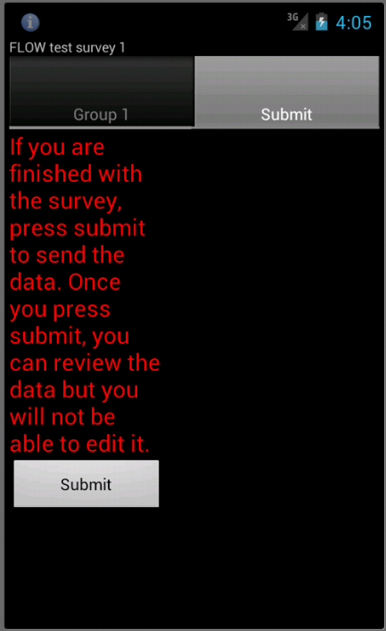
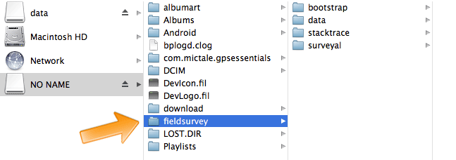
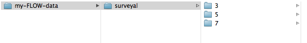
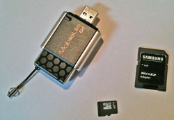
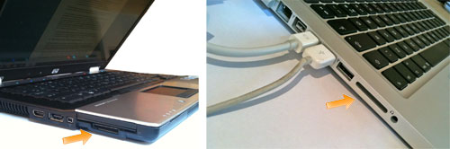
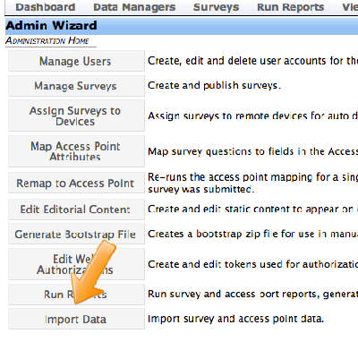
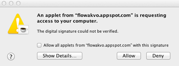
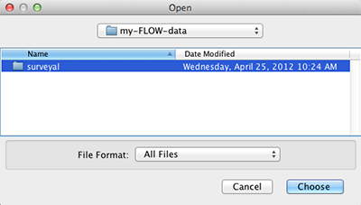
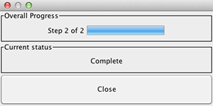

Conducting a FLOW survey
========================
*Note: If you have used your phone in a previous data collection exercise, it is important to clear all the data off of the phone before you begin the next exercise so that you do not run the risk of exceeding the storage limits of your phone’s SD card and potentially losing data. If you use your phone for ongoing data collection, it is important to clear the phone of data at regular intervals. *

Surveys that are assigned to your phone appear on the Field Survey home screen when you launch the application. 

When you click the **survey** icon IMAGE survey_icon.png for the survey you wish to open, the survey opens, allowing you to enter responses to the questions. When you finish entering responses, you submit the survey and the data is sent to the FLOW dashboard, where it will be stored and analysed.

From within the survey, clicking the **Menu** button will display a menu from which you can select your desired survey language(s) and change the question text size. Other options available from this menu are **Clear** which will erase all survey responses from the screen and **Save and Start New** which will save the current answers WITHOUT sending them to the server and start a new survey.  Once a survey is completed the **Submit** button should always be used to send the data to the central database.

The following table explains the options displayed in the Survey menu. 

INSERT TABLE

Navigating a survey 
-------------------
Before you begin collecting data, you must understand that each survey contains a series of questions and the questions are organized into smaller sets as question groups. Each group of questions appears in a separate tab on the screen. You can fill in the questions in any order, moving from tab to tab.  

**Question types**

Surveys can consist of a number of different question types.

- **Free text question** – The answer to the question is entered by the user in free text.

- **Option question** – The respondent can chose between several answer options proposed. For example: Yes/ No/ Maybe. You can set the number of answers allowed. When limiting it to one specific answer, the options are visible through small selectable circles. If you allow multiple answers, the options will be visible as tickable items. 

- **Dependent questions** – Based on the answer to a question, additional questions are displayed or hidden.

- **Mandatory questions** – A survey cannot be submitted without all the mandatory questions being answered. 

- **Number question** – The answer to the question needs to be a number.  You can choose to allow signs or decimal signs and can also set minimum and maximum values to prevent mistyping. 

- **Geo-location questions** - use the device’s GPS chip to automatically fill in latitude, longitude and elevation. Click the Check Geo Location button to fill in these questions.

- **Photo questions** – present the option to take a photo or video to supplement your data. Click the Take Photo or Take Video buttons to use the phone camera. A green check mark appears beside the photo question to indicate that a photo has been taken. 
*Note: To preview the photo, long-click the checkmark. Press the back button to close the preview. If you wish to replace the photo, click Take Photo again to retake the picture.*

- **Video questions** – It will launch the video camera and instruct the surveyor take a video. (Keep in mind that photos and videos take up a lot of memory when deciding to put in these types of questions).

- **Date** – This will record the date.

- **Barcode** – It will launch the barcode reader app of your phone (You will need to have download it on your smartphone before) and instruct you to scan the barcode of a facility.

**Help options**
Surveys can be configured to include help options. Help can take the form of text, a series of images or a video. If help is available for a specific question the **help** icon IMAGE help_icon.png is displayed next to the question text. Click this icon to open the help tool.

**Language**
TEXT ABOUT LANGUAGE FEATURES> BLOG CAETIE BASIC INSTRUCTIONS???

Submitting a survey
-------------------
When you complete a survey, you must submit it for upload to the FLOW server for storage and analysis. Immediate submission is recommended so that data backup is available in case your phone is lost or damaged. 

When you click **Submit** at the end of a survey, the survey is locked to prevent further editing, and uploaded to the FLOW server immediately. If network connectivity is not available, the survey is queued in the phone until connectivity is restored. The data will automatically be sent to the server. This connection can be via Wi-Fi or over cellular networks. It is easy to check the status of the data transmission within the application under the survey status icon. You also have the option within the phone to select either 2G or 3G networks. If you are in an area where there are only 2G networks, having the phone constantly searching for 3G networks will drain the battery.

It is always better to submit data from the device right away over the network. If users store data on their devices while waiting for an opportunity to import it later, there is always the danger of permanent data loss if the device is damaged or lost.

*Note: Ensure that the date and time setting on your phone is correct before you submit a survey.*

**To submit a survey:**

1.	From within a survey, navigate to the **Submit** tab, which is the last tab in the survey. If there are unanswered mandatory questions, the Submit tab lists these questions. The **Submit** button is disabled till all mandatory questions are answered.
2.	Review the list and enter responses for these questions. You can click on each tab to locate the question and enter a response. The unanswered mandatory questions are highlighted for easy identification.
3.	Once all mandatory questions have been answered, return to the Submit tab and click the **Submit** button.

IMAGE
.. figure:: img/3-installing-app-2-arrow.gif
   :width: 200 px
   :alt: image of phone
   :align: center

Saving and reviewing a survey
-----------------------------
Surveys responses are automatically saved as you answer them. If you want to save a partially completed survey for later and begin a new survey, use the **Save and Start New** menu option.

When you have to stop a survey midway and then continue it later, you can retrieve the partly filled survey using the Review Saved Surveys feature IMAGE https://github.com/akvo/akvo-flow-docs/blob/flow15update/docs/topic/fieldapp/img/5-3review_saved_surveys.png. (For example, you might have to take the GPS location at a water point, and then walk a distance to interview someone to complete the rest of the survey.)  

This feature gives you quick access to:

•	Surveys that were saved but not submitted - Click on the **survey name** to open the survey and continue entering responses.

Icons next to each survey will depict at what stage of transmission it is in. A green check for successful, a yellow dot for queued, a blue arrow for in progress and a red cross for failed. 

If you want more in depth information, long click on an individual submission and then select transmission history.

•	Submitted surveys – Click on the **Menu** icon and then choose **Submitted Surveys**. You can view a previously submitted survey, but not edit it.
  

Checking survey data status and transmission
--------------------------------------------
Before you delete all data from the Application it is important to check if all the collected data have been successfully submitted to the dashboard, otherwise you might loose your data. 

**To check the survey data status and transmission:**

1.	Open the **Field Survey App**
2.	Click **Survey Status**
3.	Click **Review Submitted Surveys**. You will see a list with the transmission status of every stored survey on the phone that has been submitted in chronological order. The listing displays the most recent status: 
*	a.	**Green check** for **Sent**
	b.	**Yellow circle** for **Queued**
	c.	**Blue arrow** for **In progress/Submitted**
	d.	**Red cross** for **Not sent** *

---

old content from 5-2 submitting a survey

Network submission of surveys
-----------------------------

When the user completes a survey in the Field Survey app, they are presented with a submission screen. If a network or wi-fi connection is available, pressing the "Submit" button sends the completed survey data and any associated image files to the FLOW server. If a network or wi-fi connection is not available, pressing the "Submit" button queues the data for submission next time a connection is available, and makes the survey data and image files available on the device's SD card. 

.. note::
	It is always better to submit data from the device right away over the network. If users store data on their devices while waiting for an opportunity to import it later, there is always the danger of permanent data loss if the device is damaged or lost. 

Alternative - manual submission of surveys
------------------------------------------

If you don't have a network or wi-fi connection, you can upload survey data manually. This process takes 2 steps: 1) getting the data off the device and on to a computer, and 2) uploading the data to the Dashboard. The first step can be done in multiple ways, as described below.

.. note::
	The default setting in the Field Survey app is to store survey data files on the device's SD card. If users are storing survey data files on internal memory, before they transfer the data from the device to the computer, they must first export it to the SD card, using Field Survey home screen > Settings > Export Data.

1. Transferring the data from a device to a computer using a USB cable
*****************************************************************************
1. Attach the phone to the USB port of a computer using the USB cable that came with the phone. If the phone displays a screen that asks you to connect the USB, accept this option.

2. Locate the phone folder on your computer's hard drive. It may be called NO NAME. Open this folder. This folder has the content of the SD card on your phone. Open the subfolder "fieldsurvey."

3. In the "fieldsurvey" folder you will see a folder called "surveyal". This folder contains all exported survey data. Make a copy of the entire folder 'surveyal' and transfer the copy to a folder on your computer. When this is finished, you can upload the data in the Dashboard (see section below).

   
   The folder "surveyal" has been copied to a local folder "my-FLOW-data"

4. Eject the SD card in a safe way before removing the USB cable or the SD card from the computer.

.. note::
	The folder "surveyal" has a complicated-looking structure, with a lot of sub-folders with single-digit names. e.g. "fieldsurvey/survayal/3/5/6/2/4/". The actual .zip files, which have names like "wfp10339376830983.zip" are located somewhere in this folder structure. This structure is needed to guard against possible data-loss due to limitations on the number of files in a single directory.

	If the survey contains photos, they will not be contained in the .zip file, and instead stored separately as .jpg files somewhere in the same folder structure.

	Please take note: although the files have the extention .zip, they are not meant to be unzipped before they are uploaded. Instead, the .zip file contains the data in a packed format, meant to be uploaded to the Dashboard.

2. Alternative - getting the data of the phone using the SD-card directly
********************************************************************************
If for some reason the phone cannot be connected to a USB cable, you can also get the data of the SD card directly. 

1. Get the SD card out of the phone. Please consult your phone manual on how to do this. Usually, phones have a micro-SD card, for which you need an adapter. What you need depends on your computer. If your computer has an SD card slot, you need a "micro-SD to SD-card" adapter. If your computer does not have such a slot, you need a "micro-SD to USB" adapter. The photo below shows both types of adapters. 

   
   From left to right: A "micro-SD to USB" adapter, a micro-SD card, and a "micro-SD to SD card" adapter.

2. Connect the SD card to your computer, either using the SD card slot, or through a USB port.

   
   SD card slots in a PC and a Mac laptop.

3. The SD card will show up as an external hard disk. It may be called "NO NAME". From here on, follow the steps in the section above, starting at step 2.

3. Uploading the data to the Dashboard
****************************************  
Once you have succesfully copied the "surveyal" folder to your computer, you can upload it to the Dashboard. There is no need to know which .zip file particularly to upload: the upload mechanism will search through all subfolders and extract the right files.

1. Open the Dashboard in a web browser on your computer

2. In the menu item "Data Managers", select "Admin Wizard". **Don't** select "Data Upload", that is for individual .zip files only.

3. Select "Import Data" from the list.

   
4. Select "Bulk Import Surveys" from the list.

.. figure:: img/9-submit-manual-9-arrow.png
   :width: 350 px
   :align: center
   
5. You will be asked for permission to run a Java applet on your computer. Click "Allow"

6. Navigate to the "surveyal" folder on your computer and select it. Select the folder and click "Choose" (In a previous step, you copied this folder from the phone).

   
7. The data will now be uploaded. A popup shows the progress. When it shows "Complete", click "Close".

.. figure:: img/9-submit-manual-9c.png
   :width: 300 px
   :align: center
   
   Data still uploading ...
   

   
   Upload complete.
   
8. The data is now uploaded. You can check this by selecting "Raw Data Manager" in the "Data Managers" menu. Select the survey group and the survey and click "Find". The data for the survey will be shown in reverse chronological order, and the data you have uploaded should appear according to the date the survey was recorded (not according to the date it was manually uploaded). 

Contents:

.. toctree::
   :maxdepth: 3
   
   4-conducting-survey/4-1-navigating-survey
   4-conducting-survey/4-2-submitting-survey
   4-conducting-survey/4-3-saving-survey
   4-conducting-survey/4-4-checking-survey-status

