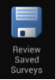

Conducting a FLOW survey
========================

*Note: If you have used your phone in a previous data collection exercise, it is important to clear all the data off of the phone before you begin the next exercise so that you do not run the risk of exceeding the storage limits of your phone’s SD card and potentially losing data. If you use your phone for ongoing data collection, it is important to clear the phone of data at regular intervals.*

Surveys that are assigned to your phone appear on the Field Survey home screen when you launch the application. 

Click the **survey** icon for the survey you wish to open.

   
The survey opens and allows you to enter responses to the questions. When you finish entering responses, you submit the survey and the data is sent to the FLOW dashboard, where it will be stored and analysed.

From within the survey, clicking the **Menu** button will display a menu from which you can select your desired survey language(s) and change the question text size. Other options available from this menu are **Clear** which will erase all survey responses from the screen and **Save and Start New** which will save the current answers WITHOUT sending them to the server and start a new survey.  Once a survey is completed the **Submit** button should always be used to send the data to the central database.

The following table explains the **options displayed in the Survey menu**. 

=========================================	==========================================================================================================================================================================================================================================
Large Text						Makes text appear larger for easy reading. 

Normal text						Changes text size from large to normal.

Clear							Erases all responses entered into the survey without sending it to the server. To clear the response to a particular question, long-click the question text and click OK. 

Save and Start New					Saves current survey responses and starts a new survey, clearing all input values. The saved version appears under the Review Saved Surveys icon on the home screen. You can edit it later and then submit it. 

Languages						Allows you to select one or more languages in which you want the survey questions to appear, if the survey was configured to support multiple languages. 
							*Note: The survey may take a few seconds to reload after switching languages.*

Submitted Surveys					Shows a list of submitted surveys. Submitted surveys cannot be edited; you can open them in read-only mode. 
=========================================	==========================================================================================================================================================================================================================================

Navigating a survey 
-------------------
Before you begin collecting data, you must understand that each survey contains a series of questions and the questions are organized into smaller sets as question groups. Each group of questions appears in a separate tab on the screen. You can fill in the questions in any order, moving from tab to tab.  

Question types
~~~~~~~~~~~~~~

Each survey contains a series of questions and the questions are organized into smaller sets as question groups. Each group of questions appears in a separate tab on the device screen. The different question types are explianed in detial in the `Akvo FLOW dashboard section about surveys <http://flow.readthedocs.org/en/latest/docs/topic/dashboard/2-surveys.html#survey-structure-in-flow.html>`_ .

Help options
~~~~~~~~~~~~

Surveys can be configured to include help options. Help can take the form of text, a series of images or a video. If help is available for a specific question the **help** icon IMAGE help_icon.png is displayed next to the question text. Click this icon to open the help tool.

Language
~~~~~~~~

If you've created surveys with translations on the dashboard and assigned them to your devices, you can access those translations on the device for conducting surveys in the field.

**Navigate and display translations on device:**

To display one or more translations for a survey, first tap the **survey icon** for your survey from the field survey app home screen. This will open the survey.

From here, tap your device’s **menu button**, which will prompt a set of options to slide up from the bottom of the screen. Select **languages**. This will display all of the available translations (ie, the ones you entered on the dashboard) for all the surveys on the device.

 .. figure:: img/5-conducting-surveys_devicelanguages.jpg
   :width: 200 px
   :alt: image of phone
   :align: center
   
   Selecting a language for survey display.
   
Tick one or more of the language boxes. Ticking just one language will display just that language for the survey. Ticking more than one will display multiple languages in different colors. The question text, question options, and tooltips will display in all of the translations you’ve selected if they’ve been entered and published from the dashboard.

Complete the survey and click the **submit button** at the end. The notifications bar across the top of the phone screen will tell you when the survey data has been successfully submitted. You can also check this from the Survey Status icon from the app home screen, from Review Submitted Surveys.

Submitting a survey
-------------------
When you complete a survey, you must submit it for upload to the FLOW server for storage and analysis. Immediate submission is recommended so that data backup is available in case your phone is lost or damaged. 

When you click **Submit** at the end of a survey, the survey is locked to prevent further editing, and uploaded to the FLOW server immediately. If network connectivity is not available, the survey is queued in the phone until connectivity is restored. The data will automatically be sent to the server. This connection can be via Wi-Fi or over cellular networks. It is easy to check the status of the data transmission within the application under the survey status icon. You also have the option within the phone to select either 2G or 3G networks. If you are in an area where there are only 2G networks, having the phone constantly searching for 3G networks will drain the battery.

It is always better to submit data from the device right away over the network. If users store data on their devices while waiting for an opportunity to import it later, there is always the danger of permanent data loss if the device is damaged or lost.

Note: Ensure that the `date and time setting <http://flow.readthedocs.org/en/latest/docs/topic/fieldapp/2-preparing-device.html#setting-data-and-time-on-the-phone.html>`_  on your phone is correct before you submit a survey.

**To submit a survey:**

1.	From within a survey, navigate to the **Submit** tab, which is the last tab in the survey. If there are unanswered mandatory questions, the Submit tab lists these questions. The **Submit** button is disabled till all mandatory questions are answered.
2.	Review the list and enter responses for these questions. You can click on each tab to locate the question and enter a response. The unanswered mandatory questions are highlighted for easy identification.
3.	Once all mandatory questions have been answered, return to the Submit tab and click the **Submit** button.

.. figure:: img/9-submit-manual-10.png
   :width: 200 px
   :align: center

Saving and reviewing a survey
-----------------------------
Surveys responses are automatically saved as you answer them. If you want to save a partially completed survey for later and begin a new survey, use the **Save and Start New** menu option.

When you have to stop a survey midway and then continue it later, you can retrieve the partly filled survey using the Review Saved Surveys feature. 

(For example, you might have to take the GPS location at a water point, and then walk a distance to interview someone to complete the rest of the survey.)  

This feature gives you quick access to:

•	Surveys that were saved but not submitted - Click on the **survey name** to open the survey and continue entering responses.

Icons next to each survey will depict at what stage of transmission it is in. A green check for successful, a yellow dot for queued, a blue arrow for in progress and a red cross for failed. 

If you want more in depth information, long click on an individual submission and then select transmission history.

•	Submitted surveys – Click on the **Menu** icon and then choose **Submitted Surveys**. You can view a previously submitted survey, but not edit it.
  

Checking survey data status and transmission
--------------------------------------------
Before you delete all data from the Application it is important to check if all the collected data have been successfully submitted to the dashboard, otherwise you might loose your data. 

**To check the survey data status and transmission:**

1.	Open the **Field Survey App**
2.	Click **Survey Status**
3.	Click **Review Submitted Surveys**. You will see a list with the transmission status of every stored survey on the phone that has been submitted in chronological order. The listing displays the most recent status: 
	
|		**Green check** for **Sent**
|		**Yellow circle** for **Queued**
|		**Blue arrow** for **In progress/Submitted**
|		**Red cross** for **Not sent** 
