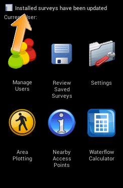
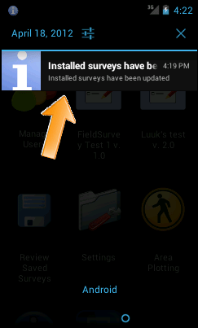

Getting surveys on the phone 
=================================

Automatic download
---------------------
If you have sucessfully installed the Field Survey app on the phone, and you have a wifi connection, the phone will send a 'beacon signal' to the web-based Dashboard. In the Dashboard, surveys can then be assigned to the phone (XXX-reference-XXX). If this proces fails, please consult the troubleshooting guide (XXX-reference-XXX)

Every time the Field Survey app is launched, the application checks for new surveys assigned to it, or updates of existing surveys. If there are new or updated surveys available, it will download them automatically. When new or updated surveys have been downloaded, the status bar will show a notification. 

   
You can see the full notification by drawing down the status bar (put your finger on the top of the screen and slide downwards. Slide upwards again to close the notification screen).

   
The surveys are not displayed immediately. You need to close the application and reopen it. After reopening, the downloaded survey will be shown in the main menu. Sometimes you will need a few attempts before the surveys show up.   

   
Manual method
---------------
If there is no wifi available, you can put the survey on the phone using a manual method. This is explained in the troubleshooting section (XXX-reference-XXX)

