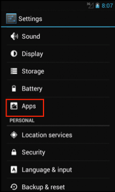
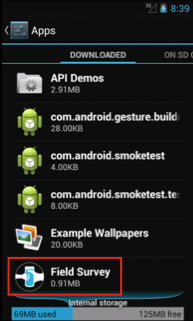

Post-survey
===========

Check transmission history
--------------------------
**To check the transmission history:**

1.	Open the **Field Survey App**
2.	Click **Survey Status**
3.	Click **Review Saved Surveys** or see also check the survey data status and transmission. 
4.	Long press on a survey and click **Transmission history** to see the history. 

Check SD card status
--------------------
After data collection, you need to check if there is enough space available on your SD card for your next field visit. How to do this, see Check SD card status.

Clearing devices of data 
------------------------
If you have been using the phones extensively or for a previous data collection, it is important to clean them up properly for the next data collection. 

This is important because data are not deleted by the app, so the surveyal folder increases in size. When s3 is used, this is not an issue, as the phone knows what data has been uploaded, and only uploads non-uploaded data. However, when bulk upload is used, the surveyal folder is always uploaded completely, which means that the cumulative data is being send each time. This becomes a burden and increases the risk of the bulk upload failing.

You need to ensure that all that data has been successfully submitted to the FLOW server. This will safeguard you from running the risk of exceeding the storage limits of your phone’s SD card. If you exceed the limits of your phone’s SD card, you could potentially permanently lose survey data and/or images.

Therefore, you need to: 

-	make sure all the data and images are uploaded
-	make sure the data is exported to the SD card
-	make sure the surveyal folder is backed up to the hard drive of a computer
-	empty the surveyal folder
-	empty the DCIM folder (which holds the camera images)

Uninstalling Field Survey app
-----------------------------
**To uninstall the Field Survey App:**
1.	From the home screen of the phone, select **Settings** by clicking on the menu button. 

IMAGE

2.	From the list, select **Apps** or **Applications**. On some phones, you need to navigate to **Settings > Applications**, and then select **Manage Applications**.

   
3.	Scroll down the list and click on the **Field Survey** icon.   
   

   
4.	Click **Uninstall** and then click **OK**.

IMAGE
   
The old version is uninstalled. Proceed to install the new version of the APK. 
