Submitting surveys manually
=============================

If you don't have a wifi connection, you can upload survey data manually. This process takes 3 steps: 1) exporting the data in the Field Survey app, 2) getting the data off the phone and on a computer, and 3) uploading the data to the Dashboard. The first step can be done in multiple ways, as described below.

Exporting the data in the Field Survey app
--------------------------------------------

1. In the main menu, click "Setings"

.. figure:: img/93-submit-manual-1-arrow.gif
   :width: 200 px
   :align: center

2. In the Settings menu, click on "Export Data"

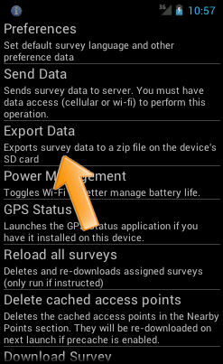

3. You should see a message at the top of the phone in the notification bar that says Data has been exported to SD card. If you pull down the notification, it will display the file name of the exported data, for example: wfp2829869345962-all.zip

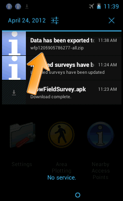

Getting the data off the phone using a USB cable
----------------------------------------------------

1. Attach the phone to the USB port of a computer using the USB cable that came with the phone. If the phone displays a screen that asks you to connect the USB, accept this option.

2. Locate the phone folder on your computer's hard drive. It may be called NO NAME. Open this folder. This folder has the content of the SD card on your phone. Select the subfolder "fieldsurvey"

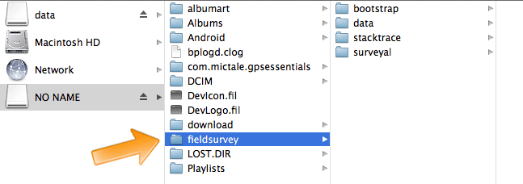

3. In the "fieldsurvey" folder you will see a folder called "surveyal". This folder contains all exported survey data, including the file you created in step 2. Copy the entire folder 'surveyal' to a folder on your computer. When this is finished, you can upload the data in the Dashboard (see section below).

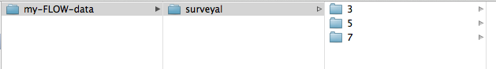
   
   The folder "surveyal" has been copied to a local folder "my-FLOW-data"

4. Eject the SD card in a safe way before removing the USB cable or the SD card from the computer.

.. note::
	The folder "surveyal" has a complicated-looking structure, with a lot of sub-folders with single-digit names. e.g. "fieldsurvey/survayal/3/5/6/2/4/". The actual .zip files, which have names like "wfp10339376830983.zip" are located somewhere in this folder structure. This structure is needed to guard against possible data-loss due to limitations on the number of files in a single directory.

	If the survey contains photos, they will not be contained in the .zip file, and instead stored separately as .jpg files somewhere in the same folder structure.

	Please take note: although the files have the extention .zip, they are not meant to be unzipped. Instead, the .zip file contains the data in a packed format, meant to be uploaded to the Dashboard.

Alternative - getting the data of the phone using the SD-card directly
-----------------------------------------------------------------------
If for some reason the phone cannot be connected to a USB cable, you can also get the data of the SD card directly. 

1. Get the SD card out of the phone. Please consult your phone manual on how to do this. Usually, phones have a micro-SD card, for which you need an adapter. What you need depends on your computer. If your computer has an SD card slot, you need a "micro-SD to SD-card" adapter. If your computer does not have such a slot, you need a "micro-SD to USB" adapter. The photo below shows both types of adapters. 

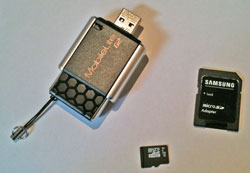
   
   From left to right: A "micro-SD to USB" adapter, a micro-SD card, and a "micro-SD to SD card" adapter.

2. Connect the SD card to your computer, either using the SD card slot, or through a USB port.

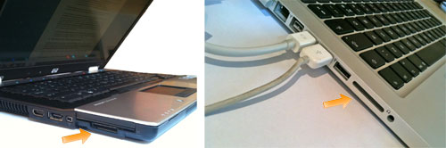
   
   SD card slots in a PC and a Mac laptop.

3. The SD card will show up as an external hard disk. It may be called "NO NAME". From here on, follow the steps in the section above, starting at step 2.

Uploading the data to the Dashboard.
--------------------------------------
Once you have succesfully copied the "surveyal" folder to your computer, you can upload it to the Dashboard. There is no need to know which .zip file particularly to upload: the upload mechanism will search through all subfolders and extract the right files.

1. Open the Dashboard on your computer

2. In the menu item "Data Managers", select "Admin Wizard". **Don't** select "Data Upload", that is for individual .zip files only.

3. Select "Import Data" from the list.

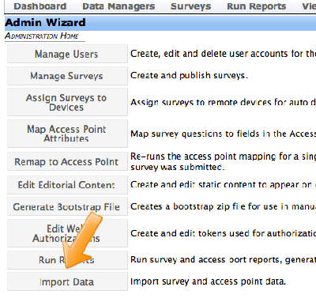
   
4. Select "Bulk Import Surveys" from the list.

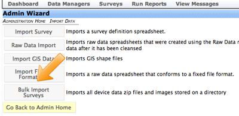
   
5. You will be asked for permission to run a Java applet on your computer. Click "Allow"

.. figure:: img/93-submit-manual-9a.png
   :width: 350 px
   :align: center

6. Navigate to the "surveyal" folder on your computer and select it. Select the folder and click "Choose" (In a previous step, you copied this folder from the phone).

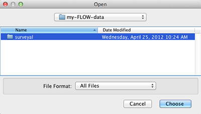
   
7. The data will now be uploaded. A popup shows the progress. When it shows "Complete", click "Close".

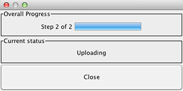
   
   Data still uploading ...
   
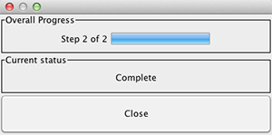
   
   Upload complete.
   
8. The data is now uploaded. You can check this by selecting "Raw Data Manager" in the "Data Managers" menu item. Select the survey group and the survey and click "Find". The data for the survey will be shown chronologically, and the data you have uploaded should appear in the right place. 