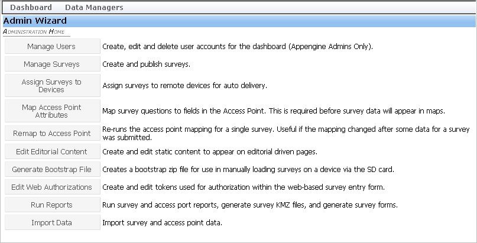
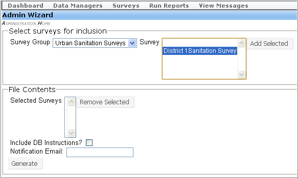
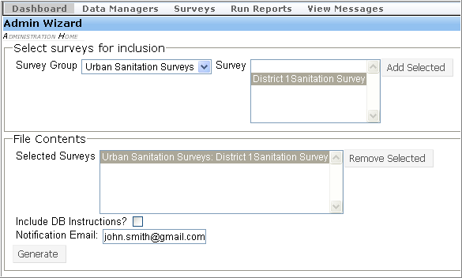

Generate Bootstrap File
-------------------------

If network connectivity is low, FLOW provides an alternative way to upload surveys to devices. You can generate a bootstrap file that includes the surveys you want to assign, and email it to users. The files can then be manually loaded onto the device. 

**To generate a bootstrap file**:

1. In the Admin Wizard menu, select **Generate Bootstrap File**. 

 
2.	Select the survey that you want to include in the file. In the Survey Group field, select the **Survey Group** for the survey. 

3.	The Survey field shows all the surveys that come under the selected group. Select the survey or surveys you want to include, and then click **Add Selected**.

 
4.	The File Contents section shows the list of surveys you selected to include in the file. Review the list to make sure all the required surveys are included. To add more, repeat steps 2 and 3. To remove any surveys that you accidentally included, click **Remove Selected**.
 
5.	To notify a particular user when the file becomes available, enter the recipient’s email address in the Notification Email field.

6.	To generate the file, click **Generate**. 

7.	A message confirms file generation. Click **OK**.
