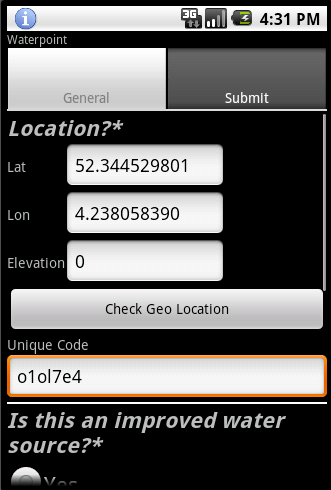

EXAMPLES - not part of documentation
==========================================

This document contains examples of how to layout text and images in RST.

|more| Linking to other documents :ref:`uploading data <uploading_data>`

Including an image with a caption:

   This is the caption of the figure. In the code, don't forget to indent the text.
   
   
Next section
-----------------

The standard inline markup is quite simple: use

* one asterisk: ``*text*`` (result *text*) for emphasis (italics),
* two asterisks: ``**text**`` (result **text**) for strong emphasis (boldface), and

Another section
------------------
List markup is natural: just place an asterisk at
the start of a paragraph and indent properly.  The same goes for numbered lists;
they can also be autonumbered using a ``#`` sign::

   * This is a bulleted list.
   * It has two items, the second
     item uses two lines.

   1. This is a numbered list.
   2. It has two items too.

   #. This is a numbered list.
   #. It has two items too.

The result is:
   * This is a bulleted list.
   * It has two items, the second
     item uses two lines.

   1. This is a numbered list.
   2. It has two items too.

   #. This is a numbered list.
   #. It has two items too.

Nested lists are possible, but be aware that they must be separated from the
parent list items by blank lines::

   * this is
   * a list

     * with a nested list
     * and some subitems

   * and here the parent list continues

The result:
   * this is
   * a list

     * with a nested list
     * and some subitems

   * and here the parent list continues

Definition lists are created as follows::

   term (up to a line of text)
      Definition of the term, which must be indented

      and can even consist of multiple paragraphs

   next term
      Description.

With this result:

   term (up to a line of text)
      Definition of the term, which must be indented

      and can even consist of multiple paragraphs

   next term
      Description.

Note that the term cannot have more than one line of text.

Quoted paragraphs are created by just indenting
them more than the surrounding paragraphs.

	For example, this is a quoted paragraph.

A simple table is done like this::

   =====  =====  =======
   A      B      A and B
   =====  =====  =======
   False  False  False
   True   False  False
   False  True   False
   True   True   True
   =====  =====  =======

with this result:

   =====  =====  =======
   A      B      A and B
   =====  =====  =======
   False  False  False
   True   False  False
   False  True   False
   True   True   True
   =====  =====  =======

One more section, with subsections
---------------------------------------------------

Subsection 1
^^^^^^^^^^^^^^^^

Lorem ipsum dolor sit amet, consectetur adipiscing elit. Proin in ligula et ipsum feugiat egestas ac vel arcu. Mauris sollicitudin pretium sem eget mollis. Cras sit amet mauris turpis. Ut molestie lobortis laoreet. Fusce lectus nibh, feugiat eu adipiscing a, gravida vitae risus. Suspendisse velit lorem, molestie sed commodo non, aliquet ornare arcu. Suspendisse potenti. 

Subsection 2
^^^^^^^^^^^^^^^^^
Pellentesque pellentesque lacus sed justo egestas et dignissim mauris placerat. Integer ornare, nisi vel elementum dignissim, purus elit ullamcorper massa, at tincidunt felis eros ac sem. Nunc non lacus tortor. Cras in lectus libero. Vestibulum a nisi velit. Vivamus id eros lobortis eros tempus porta. Nulla facilisi. Mauris facilisis magna sit amet ante imperdiet accumsan volutpat lectus ultricies. Quisque quis diam eros, quis porttitor est.

